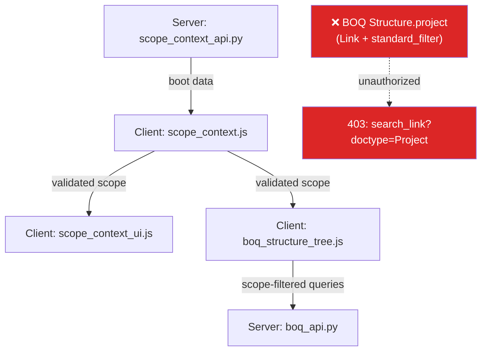
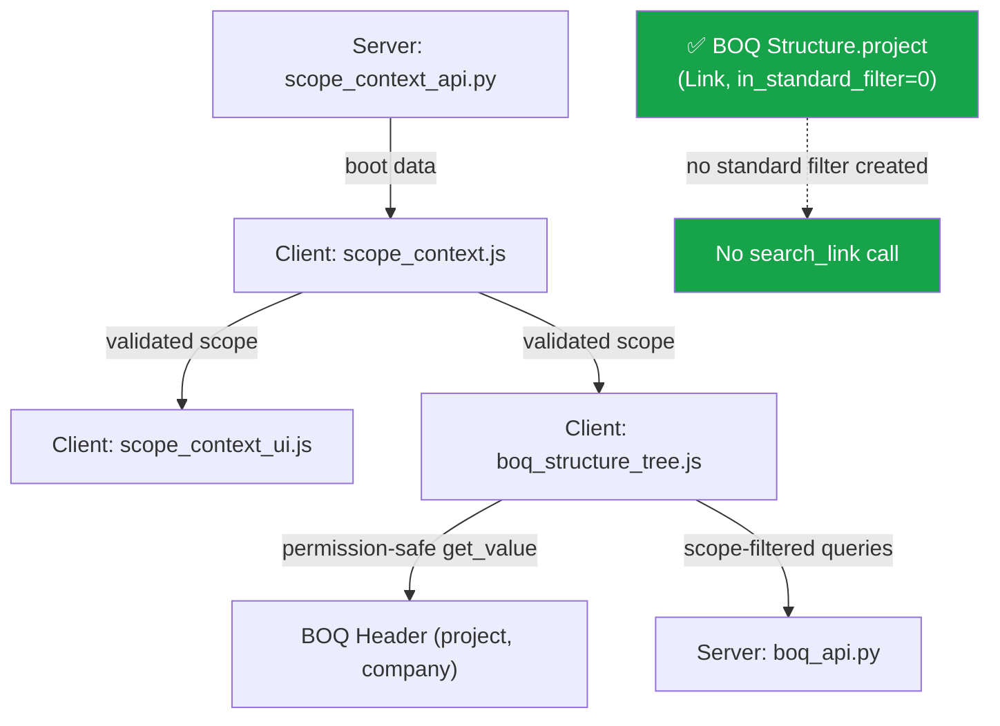

# BOQ Structure / Scope Context Hardening Plan

| Attribute | Value |
|-----------|-------|
| **Date** | 2026-06-14 |
| **Status** | ✅ **APPROVED with modifications** — execute Sprint 1 immediately |
| **Repository** | `/home/mohamed/frappe-bench/apps/construction` |
| **Branch** | `feature/vite-ui-v1` |
| **Author / Owner** | Mohamed Elrefae |
| **Engineering Reviewer** | Head of Engineering Department |
| **Priority** | P0 — blocks restricted users from using BOQ Structure |

---

## 1. Executive Summary

The scope-context refactor moved project selection authority toward a server-first model, but **one unauthorized client-side entry point remains**: the `Project` Link control on `BOQ Structure`.

Restricted users still trigger requests of the form:

```text
/api/method/frappe.desk.search.search_link
?doctype=Project
&reference_doctype=BOQ Structure
&link_fieldname=project
```

These requests return `403 Forbidden` for users without `Project` read/select permission and produce inconsistent browser behavior (Edge vs Firefox vs cloud).

**Root cause:** `BOQ Structure.project` is still defined as `Link → Project` with `in_standard_filter = 1`. Frappe instantiates `Project` Link controls from DocType metadata during standard filter initialization — this happens **before** any custom JS has a chance to intervene. Client-side guard patches cannot prevent it; only metadata changes can.

**Strategic direction:**

1. Make **server-side scope context** and **BOQ Header** the single source of truth for the active project.
2. Eliminate every client path that creates an interactive `Project` Link control for `BOQ Structure`.
3. Consolidate duplicate BOQ Structure tree scripts.
4. Replace browser-side `Project` reads with permission-safe `BOQ Header` reads.
5. Add deterministic verification so the issue cannot silently regress.

---

## 2. Problem Statement

### 2.1 Symptom

Restricted users intermittently see:

- `403 Forbidden` on `/api/method/frappe.desk.search.search_link` for `doctype=Project`.
- Inconsistent BOQ Structure tree loading across browsers/environments.
- Stale or duplicate project selectors in the UI.

### 2.2 Evidence

The failing request carries:

```text
reference_doctype=BOQ Structure
link_fieldname=project
```

A Frappe `search_link` request with these parameters can only be generated when the client holds a Link control whose field definition is:

```json
{
  "fieldname": "project",
  "fieldtype": "Link",
  "options": "Project"
}
```

Therefore, the issue is **not** limited to custom tree-filter code; the `BOQ Structure` DocType metadata itself still exposes `project` as a Link and standard filter.

### 2.3 Why It Varies by Browser

| Factor | Impact |
|--------|--------|
| Cached JS bundles | Older `boq_structure_tree.js` or `scope_context_ui.js` may still reference `project`. |
| Route options | A stale URL/route containing `project=...` can re-instantiate the Link control. |
| DocType metadata drift | One environment may not have the latest JSON or a customization may override it. |
| Role permissions | Some environments may accidentally grant broader `Project` read access, masking the bug. |
| Asset versioning | `hooks.py` registers some changed files with stale `?v=` cache busters. |

---

## 3. Root Cause Analysis

### 3.1 Competing Ownership

The active project has **multiple competing owners**:

1. **User Scope Context** (server) — intended authority.
2. **BOQ Header.project** — document-level authority.
3. **BOQ Structure.project** — leftover Link field still claiming authority.
4. **BOQ Structure.project standard filter** — exposes `Project` search to the tree/list.
5. **Custom tree filter `scope_project`** — cosmetic rename; does not remove the metadata path.
6. **Browser cache / route options** — can resurrect old control definitions.

### 3.2 Causal Chain

```
BOQ Structure.project = Link(Project)
        │
        ├─ in_standard_filter = 1  → Frappe creates a Project filter on tree/list
        ├─ read_only = 1            → but Link validation/fetch still runs
        └─ fetch_from = boq_header.project
                │
                ▼
        Restricted user opens BOQ Structure tree
                │
                ▼
        Frappe calls search_link / validate_link for doctype=Project
                │
                ▼
        403 Forbidden → inconsistent UI / blocked user
```

### 3.3 Critical Finding: Client-Side Guards Cannot Prevent This 403

The `ct_link_control.js` override patches `ControlLink` prototype methods (`on_input`, `validate`, `get_search_args`), but:

1. **Standard filter controls are created by `frappe.ui.FilterArea`** which instantiates Link controls directly from DocType metadata. These controls fire `search_link` **during initialization**, before any custom JS has a chance to intervene.
2. The `enhanceLink` function (line 197) returns early for read-only fields:
   ```js
   if (df.hidden || df.read_only) return;
   ```
   Since `BOQ Structure.project` is `read_only = 1`, the enhancer **skips it entirely**.

> [!CAUTION]
> Client-side guards are a **last-resort safety net**, not a primary fix. The only reliable fix for a standard-filter-originated `search_link` is to change the DocType metadata.

### 3.4 Architecture Diagram (Before Fix)



The red path (`F → G`) is what Sprint 1 eliminates.

---

## 4. Critical Findings Summary

| # | Finding | Severity | Fix |
|---|---------|----------|-----|
| **F1** | `project` field is `Link` + `in_standard_filter=1` → 403 on standard filter init | 🔴 P0 | Set `in_standard_filter: 0` in JSON, migrate |
| **F2** | `ct_link_control.js` skips `read_only` fields, so guard never activates for `project` | 🟡 P1 | Moot after F1 is fixed; no code change needed |
| **F3** | Direct `frappe.db.get_value("Project", ...)` in tree script → 403 for restricted users | 🔴 P0 | Replace with `frappe.db.get_value("BOQ Header", ...)` — user already has permission |
| **F4** | Duplicate orphan `public/js/boq_structure_tree.js` | 🟡 P2 | Delete it |
| **F5** | Cache buster versions are stale; some browsers serve old JS | 🟡 P1 | Bump all versions in hooks.py, full build + clear |

---

## 5. Decisions Required

### Decision 1: Fate of `BOQ Structure.project`

**APPROVED: Option 1 (conservative) — with audit precondition.**

Keep `Link` fieldtype for now. Apply these changes:

| Change | Rationale |
|--------|-----------|
| `in_standard_filter: 0` | **Required** — stops the automatic `search_link` call. |
| Keep `fieldtype: "Link"` | Preserves report/list filter compatibility. |
| Keep `options: "Project"` | Prevents SQL/report breakage from fieldtype change. |
| Keep `read_only: 1` | Already set; no change needed. |

> [!TIP]
> This single change (`in_standard_filter = 0`) is the minimum fix that unblocks the user. Converting to `Data` is a genuine improvement but can be deferred to Sprint 2 after auditing report dependencies.

**Precondition — audit before any fieldtype change:**

```sql
-- Check for custom fields referencing this
SELECT DISTINCT parent FROM `tabCustom Field`
WHERE dt = 'BOQ Structure' AND fieldname = 'project';

-- Check report/script references
grep -R "BOQ Structure.*project" apps/construction/ \
  --include="*.py" --include="*.js" --include="*.json" \
  | grep -v test | grep -v node_modules
```

**If the audit reveals dependencies on Link semantics** (e.g., report filters expecting a Link lookup):
- Keep as `Link` permanently.
- Set `in_standard_filter = 0` and `hidden = 1`.
- Add a visible `Data` field (e.g., `project_display`) showing the project name for the user.

**If no dependencies exist** (most likely):
- Convert to `Data` fieldtype in Sprint 2 as originally planned.

### Decision 2: Canonical BOQ Structure Tree Script

**APPROVED.**

Keep the registered DocType tree script. Delete the orphan public copy.

| File | Action |
|------|--------|
| `construction/doctype/boq_structure/boq_structure_tree.js` | Keep — canonical |
| `construction/public/js/boq_structure_tree.js` | Delete — orphan, not registered in hooks.py |

### Decision 3: Scope Dropdown Permission Model

**APPROVED.**

Scope dropdowns must use dedicated whitelisted APIs (already partially implemented via `scope_context_api.py`). They must **not** rely on generic `Project` Link permissions.

---

## 6. Sprint-Based Execution Plan

> [!IMPORTANT]
> Do NOT execute all phases at once. The user is blocked. Ship the minimum fix first.

### Sprint 1: Unblock User (~3 hours)

**Phases included:** F1 → F4 → F3 → F5 → verify

#### Step 1 — Fix DocType Metadata (fixes F1)

Edit `construction/construction/doctype/boq_structure/boq_structure.json`:

**Conservative diff (recommended for Sprint 1):**

```diff
  {
    "fieldname": "project",
    "fieldtype": "Link",
    "options": "Project",
    "fetch_from": "boq_header.project",
    "fetch_if_empty": 1,
    "in_list_view": 1,
-   "in_standard_filter": 1,
+   "in_standard_filter": 0,
    "read_only": 1
  }
```

**Alternative diff (if audit shows no Link dependencies):**

```diff
  {
    "fieldname": "project",
-   "fieldtype": "Link",
-   "options": "Project",
+   "fieldtype": "Data",
+   "options": null,
    "fetch_from": "boq_header.project",
    "fetch_if_empty": 1,
    "in_list_view": 1,
-   "in_standard_filter": 1,
+   "in_standard_filter": 0,
    "read_only": 1
  }
```

#### Step 2 — Delete Orphan Tree Script (fixes F4)

```bash
rm /home/mohamed/frappe-bench/apps/construction/construction/public/js/boq_structure_tree.js
```

Also remove any CSS-based hiding of `scope_project` in the canonical script if the control is gone.

Add a temporary runtime diagnostic to the canonical script (remove after Sprint 1):

```js
console.info("[BOQ Structure Tree] canonical script loaded");
```

#### Step 3 — Fix Direct `Project` Read in Tree Script (fixes F3)

In `construction/construction/doctype/boq_structure/boq_structure_tree.js`, replace the `frappe.db.get_value("Project", boq_project, "company")` chain with a `BOQ Header` read — the user already has read permission on BOQ Header.

**Current code (lines ~146–169):**

```js
frappe.db.get_value("BOQ Header", boq, "project").then(function (r) {
    if (r && r.message) {
        var boq_project = r.message.project;
        if (project && boq_project !== project) {
            boq_field.set_value("").then(function () { ... });
        } else if (company) {
            frappe.db
                .get_value("Project", boq_project, "company")
                .then(function (p_res) { ... });
        }
    }
});
```

**Replacement:**

```js
frappe.db.get_value("BOQ Header", boq, ["project", "company"]).then(function (r) {
    if (r && r.message) {
        var boq_project = r.message.project;
        var boq_company = r.message.company;
        if (project && boq_project !== project) {
            boq_field.set_value("").then(function () {
                boq_field.$input.val("");
                boq_field.$input.trigger("change");
            });
        } else if (company && boq_company !== company) {
            boq_field.set_value("").then(function () {
                boq_field.$input.val("");
                boq_field.$input.trigger("change");
            });
        }
    }
});
```

This eliminates the `frappe.db.get_value("Project", ...)` call entirely by fetching company from `BOQ Header` instead.

#### Step 4 — Bump Asset Versions and Clear Cache (fixes F5)

**Bump cache busters in `hooks.py`:**

| Asset | Current | Bump to |
|-------|---------|---------|
| `ct_link_control.js` | `?v=15` | `?v=16` |
| `scope_context.js` | `?v=2` | `?v=3` |
| `scope_context_ui.js` | `?v=1` | `?v=2` |
| `scope_context_form_defaults.js` | (check) | bump if changed |
| `scope_context_list_filter.js` | (check) | bump if changed |

**Deploy:**

```bash
cd /home/mohamed/frappe-bench
bench --site v16.localhost migrate
bench --site v16.localhost clear-cache
bench --site v16.localhost clear-website-cache
bench build --app construction
```

#### Step 5 — Verify

**Manual checks (Edge + Firefox, restricted user):**

| # | Scenario | Expected |
|---|----------|----------|
| 1 | Log in as restricted user | No 403 on login |
| 2 | Open BOQ Structure tree from BOQ Header | Tree loads without errors |
| 3 | Open BOQ Structure tree with stale `project=...` route | No 403; filter ignored |
| 4 | Change scope from top bar | Tree updates correctly |
| 5 | Refresh page | No regression |

**Network assertions — the following must NOT appear:**

```text
/api/method/frappe.desk.search.search_link?doctype=Project&reference_doctype=BOQ Structure&link_fieldname=project
/api/method/frappe.client.validate_link?doctype=Project...
/api/method/frappe.client.get_value?doctype=Project...
```

**Run existing test suite:**

```bash
bench --site v16.localhost run-tests --module construction.tests.test_scope_context
```

---
---

### Sprint 2: Hardening (defer to next sprint, ~8–12 hours)

**Phases included:** Phase 3 (scope API), Phase 4 (storage hardening), Phase 7 (regression)

#### Phase 3 — Build Dedicated Scope API (deferred)

When implemented, create a whitelisted server method that returns only authorized project/company context:

```python
@frappe.whitelist()
def get_boq_header_scope_context(boq_header: str) -> dict:
    """Return safe project/company context for a BOQ Header if user is authorized."""
```

**Requirements:**
- Uses `ignore_permissions=False` on BOQ Header read.
- Validates against `get_user_scope_hierarchy()`.
- Does **not** return arbitrary `Project` search results.

#### Phase 4 — Harden Scope Context Hydration (deferred)

| # | Action |
|---|--------|
| 4.1 | Refactor `_loadFromLocalStorage()` — storage events update UI only; cannot overwrite boot `_version` |
| 4.2 | Define local storage as short-lived cache + cross-tab channel, never final authority |
| 4.3 | Strengthen or rename `getValidatedCurrentScope()` to match actual guarantees |
| 4.4 | Ensure `_emitChange()` emits only validated/sanitized scope |
| 4.5 | Server save callbacks must update `scope_version` before other tabs consume state |

**Exit criteria:**
- Cold-cache load in Edge and Firefox shows the same selected project.
- Corrupt local storage is discarded; boot/server scope wins.
- Cross-tab changes do not downgrade in-memory version.

#### Phase 7 — Full Regression Testing (deferred)

Test after Sprint 2 changes:

1. BOQ Header form (create, edit, submit).
2. BOQ Structure tree (expand, add, move, delete nodes).
3. BOQ Item Stage workflow.
4. Variation Order creation and impact on BOQ.
5. BOQ filters in list views and reports.
6. Scope context first-login modal.
7. Scope context cross-tab sync.
8. Reports/list views that previously filtered by `BOQ Structure.project`.

---

## 7. Risk Register

| ID | Risk | Likelihood | Impact | Mitigation |
|----|------|------------|--------|------------|
| R1 | Converting `project` to `Data` breaks reports/list filters | Medium | High | Audit before change; keep Link + `in_standard_filter=0` as conservative fallback |
| R2 | Stale browser cache masks the fix during verification | High | Medium | Bump all `?v=` params; `bench build`; hard-reload; test in incognito |
| R3 | `get_user_scope_hierarchy()` returns empty for restricted users | Medium | High | Dedicated scope options API (Sprint 2) that enforces authorized scope without generic Project permission |
| R4 | Duplicate tree script is accidentally loaded by another hook | Low | Medium | Grep `hooks.py` and app_include_js for references; delete orphan script |
| R5 | Link validation still fires in form view despite `in_standard_filter=0` | Medium | High | If fieldtype stays Link, add server-side `validate` hook; preferred: Data fieldtype after audit |
| R6 | Cross-tab scope sync loses selected project after server save | Low | Medium | Ensure `scope_version` in emitted event; newer versions win |
| R7 | Audit reveals unexpected report/script dependency on Link semantics | Low | Medium | Keep Link; use `hidden=1` + `project_display` Data field as workaround |

---

## 8. Rollback Plan

### 8.1 If BOQ Structure Tree Fails to Load

1. Revert the most recent `boq_structure.json` metadata change.
2. Keep tree script fix and orphan deletion (they are harmless).
3. Run:
   ```bash
   bench --site v16.localhost migrate
   bench --site v16.localhost clear-cache
   ```
4. Hard-reload browser and re-test with restricted user.

### 8.2 If Report/List Filter Regressions Occur

1. If `project` was converted to `Data`: restore `fieldtype = "Link"`, `options = "Project"`.
2. Keep `in_standard_filter = 0`.
3. Move report filtering to `BOQ Header.project` or a permission-aware server query.

---

## 9. Approval Checklist

### Sprint 1 (Execute Now)

- [x] **Decision 1** approved: keep `Link` fieldtype; set `in_standard_filter = 0`.
- [x] **Decision 2** approved: delete orphan `public/js/boq_structure_tree.js`.
- [x] **F3 fix** approved: replace `frappe.db.get_value("Project", ...)` with `frappe.db.get_value("BOQ Header", ...)`.
- [x] **F5 fix** approved: bump cache buster versions and clear all caches.
- [ ] Network verification (Edge + Firefox, restricted user) accepted as release gate.
- [ ] Existing test suite passes after changes.

### Sprint 2 (Deferred)

- [ ] Audit report dependencies on `BOQ Structure.project` Link semantics.
- [ ] Decide whether to convert `project` to `Data` based on audit results.
- [ ] Design and implement `get_boq_header_scope_context` API.
- [ ] Harden scope context local storage handling.
- [ ] Full regression testing across all BOQ features.

---

## 10. Expected Outcome

After Sprint 1:

- Restricted users can open the BOQ Structure tree without triggering `403 Forbidden`.
- No `search_link`, `validate_link`, or `get_value` requests for `doctype=Project` appear in the Network panel.
- Behavior is consistent across Edge, Firefox, and cloud deployment.

After Sprint 2:

- The active project is fully owned by **server-backed scope context** and **BOQ Header context**.
- Scope context hydration is hardened against stale/corrupt local storage.
- Future regressions are caught by explicit network assertions and automated tests.

---

## 11. Architecture Diagram (After Sprint 1)



---

## 12. Appendix: Quick Reference Commands

```bash
# Site commands
cd /home/mohamed/frappe-bench
bench --site v16.localhost migrate
bench --site v16.localhost clear-cache
bench --site v16.localhost clear-website-cache
bench build --app construction

# Test commands
bench --site v16.localhost run-tests --module construction.tests.test_scope_context
node --check apps/construction/construction/public/js/scope_context.js
node --check apps/construction/construction/public/js/scope_context_ui.js
node --check apps/construction/construction/construction/doctype/boq_structure/boq_structure_tree.js
python -m py_compile apps/construction/construction/api/scope_context_api.py

# Audit commands (before Sprint 2 fieldtype change)
echo "SELECT DISTINCT parent FROM \`tabCustom Field\` WHERE dt = 'BOQ Structure' AND fieldname = 'project';" | \
  bench --site v16.localhost console
grep -Rn "BOQ Structure.*project" apps/construction/ \
  --include="*.py" --include="*.js" --include="*.json" \
  | grep -v test | grep -v node_modules

# Search for orphan references
grep -Rn "boq_structure_tree.js" apps/construction/hooks.py
```

---

*End of plan. Approved for Sprint 1 execution.*
