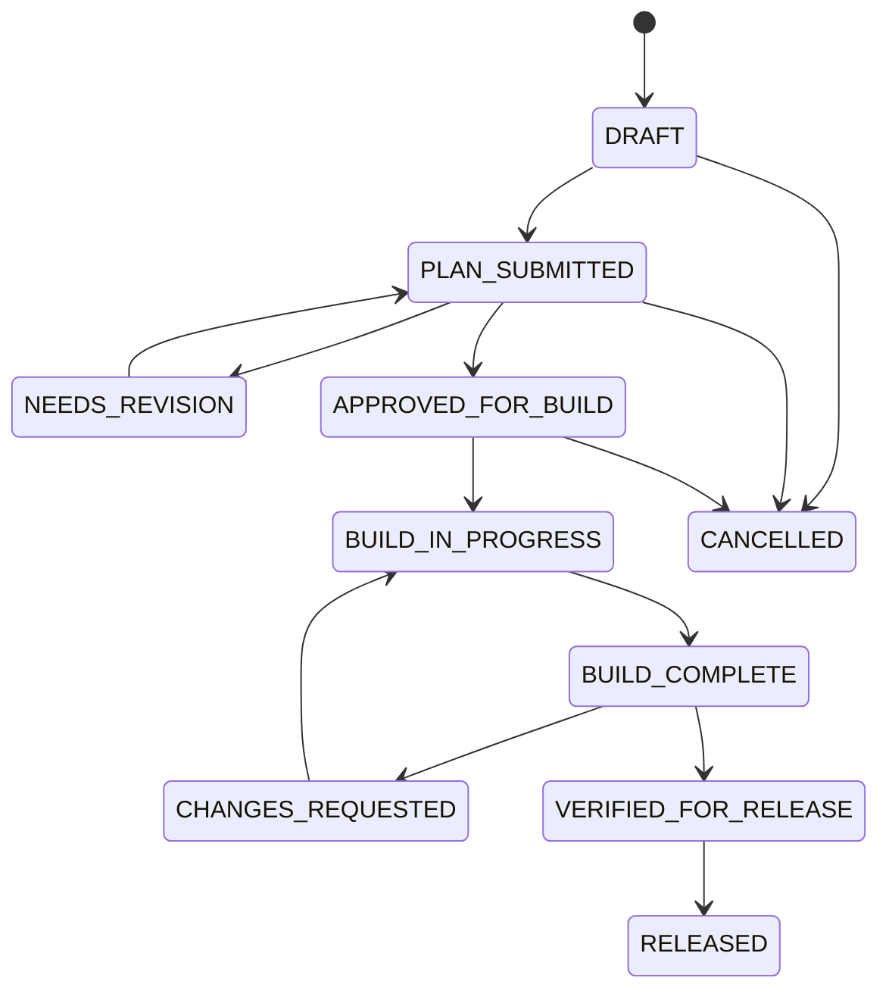

# Engineering Proposal: Evidence-Driven AI Workflow Enhancement

**Document ID:** `DOC-AI-ENHANCE-2026-08-23`  
**Date:** 2026-08-23  
**Project:** Construction ERP (`apps/construction`)  
**Target:** Frappe v15/v16-compatible application; Python 3.10-compatible source  
**Status:** `PROPOSED — approval required before implementation`  
**Owner:** Mohamed Elrefae

---

## 1. Decision Summary

Adopt a small, repository-owned workflow for planning, adversarial review, implementation, and release verification. The workflow will use durable Markdown artifacts, deterministic checks, and CI as the release authority. It will support Codex, Antigravity, OpenCode, or a human at any stage without making a particular agent, MCP server, or local machine a production dependency.

The first release deliberately does **not** auto-commit, push, deploy, run arbitrary shell commands through MCP, or attempt autonomous self-improvement. Those actions have a materially different risk profile and must remain explicitly authorized.

### Outcomes

1. A work item has one canonical status, explicit owner, bounded scope, and reproducible evidence.
2. The same task can be handed to another agent without copying a long prompt or relying on stale chat memory.
3. Fast local checks catch metadata and documentation drift; required release checks run in CI.
4. Reusable Construction conventions are packaged as portable playbooks with examples and tests, rather than tool-specific, opaque “skills.”
5. The workflow remains safe with a dirty worktree and concurrent work items.

### Non-goals for the initial rollout

- Replacing Frappe’s migrations, permissions, tests, or code review.
- Treating MCP memory as an authority; live repository files remain authoritative.
- Direct changes to ERPNext core DocType JSON.
- Automated commits to `develop`, deployment, or database mutation.
- A generic AST/knowledge-graph platform.

---

## 2. Evidence-Based Current-State Assessment

The app already has valuable foundations:

- `AGENTS.md`, `SESSION_MEMORY.md`, `docs/ai/SCHEMA_FACTS.md`, and `docs/ai/CODING_PATTERNS.md` document core facts and conventions.
- `scripts/schema_drift_checker.py`, `scripts/ai_context_check.py`, and `scripts/lint_scope_metadata.py` supply useful validation.
- `docs/ai/active/` contains plan, review, builder handoff, implementation, and final-diff artifacts for the current BOQ work.
- A post-commit memory hook and a read-only ERPNext MCP bridge already exist.

The assessment also found gaps that this proposal resolves:

| Observation | Risk | Resolution in this proposal |
|---|---|---|
| Existing active artifacts refer to `docs/ai/AGENT_WORKFLOW.md` and `docs/ai/templates/*`, but neither path exists. | Handoffs direct builders to missing instructions/templates. | Establish and validate the workflow specification and templates in Phase 1 before requiring them. |
| `docs/ai/active/` is a single shared location. | Parallel tasks can overwrite one another or make status ambiguous. | Use one directory per work item and a single machine-readable `STATE.json`. |
| Current checks are mostly manually invoked. | Quality gates are easy to skip and results are inconsistently recorded. | Split fast local checks from mandatory CI checks; record exact commands and results. |
| `session_end.py` uses a fixed local repository path and an interactive default. | It is not portable or reliable for unattended use. | Make it path-relative and explicit about non-interactive inputs; MCP failure must never change release status. |
| `preflight_check.sh` is a deployment runbook, not a code-quality preflight. | A developer may assume it validates code before implementation. | Keep deployment preflight separate and introduce a named development validation entry point. |
| Proposal assumed automatic release commits to `develop`. | An agent could commit unrelated dirty work or bypass human release approval. | Require an explicit human-authorized commit on a feature branch after CI passes. |

The existing instructions occasionally use point-in-time counts and absolute local paths. New automation must derive paths from the script location and must not treat document counts as correctness criteria.

---

## 3. Architecture Decision: Workflow Artifacts, Not a Global Active Slot

The canonical workspace will be `docs/ai/work-items/<WORK_ITEM_ID>/`. `docs/ai/active/` may remain as a legacy/current-work pointer during migration, but it must not be the authority once more than one work item is active.

`<WORK_ITEM_ID>` is lowercase kebab case, for example `boq-cost-estimation-phase-1`. A new work item is created only after its task title and scope are known.

```text
docs/ai/
  AGENT_WORKFLOW.md                 # protocol and role responsibilities
  templates/                        # repository-owned Markdown templates
  playbooks/                        # portable, tested domain guidance
  work-items/
    boq-cost-estimation-phase-1/
      STATE.json                    # canonical state and evidence pointers
      PLAN.md
      REVIEW.md
      BUILD_HANDOFF.md
      IMPLEMENTATION.md
      FINAL_REVIEW.md
```

### 3.1 Canonical state contract

`STATE.json` is the only file that declares a work item’s current state. Narrative files may describe the state, but must not override it. It has this minimum shape:

```json
{
  "schema_version": 1,
  "work_item_id": "boq-cost-estimation-phase-1",
  "title": "Phase 1 BOQ cost estimation",
  "status": "PLAN_SUBMITTED",
  "owner_role": "architect",
  "base_ref": "develop",
  "base_commit": "<full commit SHA>",
  "branch": "feature/boq-cost-estimation-phase-1",
  "updated_at_utc": "2026-08-23T00:00:00Z",
  "evidence": []
}
```

Valid statuses and allowed transitions are:



Each transition records the role, UTC time, git ref, command output file (when applicable), and a concise reason. A transition command must reject invalid transitions, unknown statuses, missing required artifacts, and a base-commit mismatch unless the planner has explicitly rebased and re-approved the plan.

### 3.2 Roles and separation of duties

The four role labels describe responsibilities, not mandatory products or named vendors. One person may perform multiple roles, but reviewer and final verifier must record an independent review; the builder cannot mark its own work `VERIFIED_FOR_RELEASE`.

| Role | May do | Must produce | Cannot do |
|---|---|---|---|
| Architect | Inspect, plan, identify validation and rollback | `PLAN.md`, `STATE.json` transition | Approve its own risky assumptions as review evidence |
| Reviewer | Challenge scope, permissions, migrations, SQL, test coverage | `REVIEW.md`, approval/revision decision | Implement scope-changing code during review |
| Builder | Change code on the named feature branch and run prescribed checks | `IMPLEMENTATION.md`, command evidence | Change approved scope or release directly |
| Final verifier | Compare diff, plan, review, and evidence; request fixes | `FINAL_REVIEW.md`, release-readiness decision | Commit, push, deploy, or suppress failing evidence |
| Human release owner | Approve merge/commit/deployment policy | Explicit commit/merge/deploy authorization | Delegate responsibility through an implied prompt |

---

## 4. Required Artifact Content

Templates must be concise and enforce the following fields. Phase 1 creates the templates before any process is declared mandatory.

| Artifact | Required information |
|---|---|
| `PLAN.md` | objective, non-goals, affected paths, schema/migration impact, permission and scope-context impact, acceptance criteria, exact validation commands, rollback approach, assumptions/open questions |
| `REVIEW.md` | reviewed commit, findings by severity, required changes, permission/SQL/migration/performance review, and explicit `APPROVED_FOR_BUILD` or `NEEDS_REVISION` verdict |
| `BUILD_HANDOFF.md` | immutable plan/review links, branch/base ref, in-scope files, exclusions, required commands, and stop conditions |
| `IMPLEMENTATION.md` | changed files and rationale, migrations, commands actually run with exit codes, test results, known limitations, and deviations approved by reviewer |
| `FINAL_REVIEW.md` | plan-conformance matrix, diff review, clean/dirty worktree disclosure, CI run URL or log, release readiness, and remaining human action |

Artifacts must link to a saved command log under `evidence/`, not paste only a success claim. Do not include secrets, database dumps, customer data, or access tokens in work-item files.

---

## 5. Validation and Release Gates

Checks are grouped by cost and authority. A passing local check is evidence, not permission to release.

| Gate | When | Deterministic checks | Authority |
|---|---|---|---|
| Context gate | Before planning/building | `schema_drift_checker.py`; `ai_context_check.py`; worktree and base-ref capture | Architect / builder evidence |
| Metadata gate | When DocType JSON changes | `lint_scope_metadata.py`; schema drift update/recheck; targeted migration tests | Builder evidence + CI |
| Code gate | Before requesting final verification | targeted Python/JS tests, formatting/linting where configured, dependency-safe import checks | Builder evidence + CI |
| Release gate | Before merge/deploy | required CI checks, final review, explicit human authorization | Human release owner |

### 5.1 Command policy

Validation commands must be configured with a site name and environment rather than hard-coding `v16.localhost`. The workflow records the exact command used, for example:

```bash
python3 scripts/schema_drift_checker.py
python3 scripts/ai_context_check.py
python3 scripts/lint_scope_metadata.py
bench --site "$TARGET_SITE" run-tests --app construction --module construction.tests.test_cost_analysis_engine
```

The future development-check wrapper should fail clearly when `TARGET_SITE` is unset or invalid. Deployment checks remain under `scripts/preflight_check.sh` and are never run automatically by a code hook.

### 5.2 Git hooks and CI

Git hooks are advisory developer ergonomics, not the source of truth. They must be versioned, installed explicitly, fast, offline, and scoped to changed files. They must not:

- start services, run `bench migrate`, access production, or invoke a browser;
- make MCP calls or depend on a local MCP Python path;
- modify tracked files during `pre-commit` or `pre-push`;
- block commits merely because a nonessential memory service is unavailable.

Initial hook behavior:

- `pre-commit`: JSON syntax validation and scope metadata lint only when relevant DocType JSON files changed.
- `pre-push`: run the development validation wrapper in a non-mutating mode when the environment is available; otherwise warn with the exact CI requirement.
- `post-commit`: may retain best-effort memory capture, but must be portable, timeout-bound, and exit successfully on MCP failure.

CI executes the required checks on every pull request/merge request and archives logs. A failure in CI blocks release regardless of local hook status.

---

## 6. Domain Playbooks (“Skill Factory”)

Create repository-local, tool-neutral playbooks under `docs/ai/playbooks/`. They are executable only in the practical sense that each contains decision rules, examples, anti-examples, a preflight checklist, and references to a test or linter. Tool-specific skill packaging can be added later only if the target runtime supports repository-local discovery.

Initial playbooks:

| Playbook | Must cover | Linked proof |
|---|---|---|
| `frappe-scope-context.md` | server-side scope enforcement, non-admin testing, display-only vs selectable scope fields, cache invalidation | `lint_scope_metadata.py` and scope tests |
| `boq-tree-operations.md` | NestedSet invariants, transactional update order, BOQ Item schema guardrails | schema drift checker and BOQ tests |
| `theme-cascade.md` | three-layer CSS cascade, v15/v16 selectors, registration/cache-buster requirements | targeted UI/manual verification checklist |
| `vfc-layout-controls.md` | layout ownership, API permissions, reset/revert behavior | VFC backend/browser tests |

`CODING_PATTERNS.md` remains the broad reference. Each playbook links back to it and must be updated in the same change as any altered convention. No automated “extract a skill from every fix” process is approved: a reviewer should promote a pattern only when it is stable, recurring, and backed by evidence.

---

## 7. MCP and Knowledge-Graph Boundary

The current ERPNext Construction MCP bridge is read-only and that boundary is appropriate for this phase. MCP memory is a convenience cache; `AGENTS.md`, DocType JSON, current git state, and verified tests are authoritative.

The proposal does not approve direct MCP test execution, schema auto-sync, write operations, or deployment controls. Before considering any expanded capability, submit a separate security design covering:

1. least-privilege identity and explicit allowlisted commands;
2. site/environment selection and protection from production targets;
3. audit logs, timeouts, redaction, and failure handling;
4. destructive-operation confirmation; and
5. tests demonstrating that an untrusted prompt cannot cause a write.

### Graph tools

No generic AST graph tool is part of the initial scope. Frappe behavior is materially driven by JSON DocType metadata, `hooks.py`, whitelisted endpoints, and database structures, which a static import graph alone does not model. This is a deferral based on current value and maintenance cost, not a permanent technology ban.

Reconsider only after a small benchmark shows that a candidate can ingest DocType JSON and hooks, answer three representative impact-analysis questions more accurately than the current schema facts/search workflow, and does so within an agreed maintenance budget.

---

## 8. Phased Implementation Roadmap

Each phase is independently releasable. Later phases do not begin until the previous phase’s acceptance criteria are met.

### Phase 0 — Baseline and decision record (0.5 day)

- Run and preserve baseline output for the three existing checks.
- Inventory active-artifact references and mark the missing workflow/template paths.
- Confirm the authoritative branch and CI provider with the release owner.

**Acceptance:** baseline evidence is saved; no code behavior changes; outstanding environment failures are recorded as blockers rather than masked.

### Phase 1 — Protocol and templates (1 day)

- Add `docs/ai/AGENT_WORKFLOW.md`, `docs/ai/templates/`, and the `docs/ai/work-items/` structure.
- Add a validator for `STATE.json` schema, work-item ID, required artifacts, allowed transitions, and evidence paths.
- Migrate exactly one existing active work item without deleting legacy artifacts; add a pointer from its legacy file.

**Acceptance:** a new work item can be created, transitioned through `PLAN_SUBMITTED` and `APPROVED_FOR_BUILD`, and rejected on an invalid transition or missing artifact.

### Phase 2 — Deterministic development gates (1–2 days)

- Create a path-relative development validation wrapper with documented modes: context, metadata, targeted tests, and full local checks.
- Make `session_end.py` portable, add non-interactive validation, and preserve its best-effort MCP behavior.
- Version the hook installer; add changed-file detection and safe timeouts.

**Acceptance:** checks run from a fresh clone with documented prerequisites; hooks do not change files, require a network, or fail a commit because MCP is unavailable.

### Phase 3 — CI enforcement (1–2 days)

- Implement CI configuration after the provider and available runner services are confirmed.
- Run context and metadata gates in CI; run relevant targeted tests; archive artifacts and logs.
- Protect the integration branch according to the human release owner’s policy.

**Acceptance:** an intentionally invalid scope field and schema-facts drift fail CI; valid pull requests publish readable evidence.

### Phase 4 — Playbooks and measurement (ongoing, bounded)

- Publish the four initial playbooks.
- Measure handoff completeness, failed-check escape rate, time to reproduce, and false-positive hook rate for four weeks.
- Promote a new playbook only through a reviewed change with a linked proof command/test.

**Acceptance:** metrics show either measurable improvement or the workflow is simplified; no unmeasured expansion into autonomous writes.

---

## 9. Risks and Mitigations

| Risk | Mitigation |
|---|---|
| Process becomes paperwork that builders bypass | Require only artifacts that feed a gate; keep templates short and validate them mechanically. |
| Concurrent agents overwrite each other | Per-work-item directories, feature branches, base-commit recording, and transition validation. |
| Stale schema documentation misleads an agent | Require the drift check before planning/building and after intended schema changes. |
| Dirty worktree causes unrelated work to be committed | Capture starting status, use a named feature branch, and require explicit human commit authorization. |
| Local machine assumptions break handoffs | Resolve paths relative to scripts; parameterize site/runtime; document prerequisites. |
| Hook fatigue or slow commits | Limit hooks to changed files and bounded time; CI remains authoritative. |
| MCP outage or hallucinated memory | Treat memory as best-effort cache and never gate release on it. |

---

## 10. Approval Requested

Approve Phases 0–1 now. Approve Phase 2 only after the Phase 1 artifact validator demonstrates correct transitions. Approve Phase 3 only after the CI provider, credentials, runner capabilities, and protected-branch policy are identified. Phase 4 remains an evidence-based improvement loop.

### Sign-off checklist

- [ ] Per-work-item workflow and `STATE.json` contract approved.
- [ ] No direct agent commit/push/deploy policy approved.
- [ ] CI, not local hooks or MCP, is the release authority.
- [ ] Existing MCP remains read-only in this scope.
- [ ] Phase 0–1 implementation authorized.
- [ ] Later phases require their stated gate before proceeding.

**Approval verdict:** [ ] Approved  [ ] Approved with conditions  [ ] Needs revision  
**Release owner:** ___________________________  
**Date:** ___________________________
