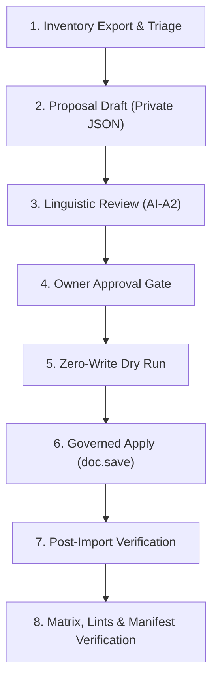

# Handover & Briefing Letter: UOM Phase 2+ Triage & Population

**To:** OpenCode Autonomous Agent / Subagent Session  
**From:** Antigravity Engineering Lane  
**Date:** 2026-10-05  
**Subject:** Mission Briefing for Bilingual UOM Phase 2+ (Inventory Triage, Phased Prioritization & Arabic Population)  
**Target Repository:** `/home/mohamed/frappe-bench/apps/construction`  
**Target Site:** `v16.localhost`  
**Current Branch:** `develop` (Base Commit: `5d96f12`)  

---

## 1. Executive Summary & Concurrent Lane Advisory

You have been tasked with leading the **UOM Phase 2+ Triage and Phased Population** stream for the ERP bilingual roadmap.

> [!IMPORTANT]
> **CONCURRENCY NOTICE:**
> Another independent agent session is concurrently working on the **Company Master Arabic Population** stream.
> To prevent git merge conflicts and test race conditions:
> 1. **Do NOT touch the `Company` DocType, data, or tests.**
> 2. **Do NOT modify shared framework files** (e.g. `construction/hooks.py`, `construction/services/bilingual_service.py`, `scripts/run_bilingual_regression_matrix.sh`, `bilingual_registry.json`).
> 3. **Confine all changes** to your designated work-item directory: `docs/ai/work-items/bilingual-uom-phase2-triage/` (plus private site files under `sites/v16.localhost/private/uom-phase2-triage/`).

---

## 2. Baseline & Prior Art (What Tier 5F Already Completed)

In **Tier 5F** (`9ccb4cd`), the primary construction operational units were audited and populated:
- **Total UOMs on site:** 253 rows.
- **Phase 1 Populated (15 rows):**
  - **12 App Fixtures** (`M3`, `M2`, `M`, `TON`, `KG`, `PCS`, `LS`, `DAY`, `HR`, `BAG`, `LTR`, `SET`).
  - **3 Active Stock Units** (`Nos`, `Tonne`, `Box`).
  - All 15 rows have `uom_name_ar` populated, server-derived `uom_name_ar_norm`, and `enabled = 1`.
  - In `construction/fixtures/uom.json`, all 12 fixtures now ship with `"enabled": 1` and `"uom_name_ar"` (preventing future `bench migrate` resets).
- **Vendor Fixtures (2 rows):** `_Test UOM` and `_Test UOM 1` are permanently excluded (never translated).
- **Pruned Test Units (2 rows):** `Pint (US)` and `Acre` were pruned from Phase 1 because their references were draft test BOQs.

---

## 3. The Problem & Scope of Phase 2+

On `v16.localhost`, there remain **236 unpopulated units**:
- **234 enabled unused vendor seed units** originating from ERPNext's stock `uom_data.json`.
- **2 pruned units** from Phase 1 (`Pint (US)`, `Acre`).

### The Golden Rule: Do NOT Bulk-Translate Blindly
ERPNext ships hundreds of obscure scientific, astronomical, and obsolete imperial units (e.g., `Attometer`, `Becquerel`, `Barn`, `Curie`, `Gauss`, `Erg`, `Farad`, `Dram`, `Minim`, `Peck`). Bulk-translating all 234 units creates translation maintenance liability, clutter in picklists, and risks linguistic inaccuracies.

### The Mission: Structured Triage & Phased Release
You must classify and triage the remaining 236 units into three distinct priority tiers:

1. **Phase 2A — Priority Construction & Engineering Physical Units (~30–45 rows)**:
   - Dimensional / Linear: `Millimeter`, `Centimeter`, `Meter`, `Kilometer`, `Inch`, `Foot`, `Yard`, etc.
   - Area & Volume: `Square Meter`, `Square Foot`, `Square Yard`, `Cubic Centimeter`, `Cubic Foot`, `Cubic Yard`, `Gallon`, etc.
   - Mass & Density: `Gram`, `Milligram`, `Pound`, `Ounce`, etc.
   - MEP / Electrical / Energy: `Kilowatt`, `Watt`, `Horsepower`, `Volt`, `Ampere`, `Joule`, etc.
   - Time: `Minute`, `Second`, `Week`, `Month`, `Year`.
2. **Phase 2B — Commercial, Packaging & Material Handling Units (~20–30 rows)**:
   - Packaging / Bundling: `Roll`, `Bundle`, `Carton`, `Packet`, `Pallet`, `Pair`, `Dozen`, `Ream`, `Container`, `Sheet`, `Coil`, `Pack`, `Drum`, etc.
3. **Phase 2C / Permanent Exclusions (~160+ rows)**:
   - Highly specialized physics / radiological / obsolete units: `Becquerel`, `Gray`, `Sievert`, `Candela`, `Lumen`, `Lux`, `Farad`, `Henry`, `Tesla`, `Weber`, `Barn`, `Chain`, `Furlong`, `League`, `Gill`, `Fluid Ounce`, etc.
   - Explicitly document these as **Exclusions / Phase 2C Deprioritized**.

---

## 4. Governed Step-by-Step Workflow

Follow the battle-tested bilingual governance cycle used in Tiers 5B through 5G:



### Step 1: Inventory & Categorization Script
Create `docs/ai/work-items/bilingual-uom-phase2-triage/evidence/scripts/export_uom_phase2_triage.py`:
- Connects to `v16.localhost`.
- Reads all 253 rows of `tabUOM`.
- Confirms the 15 Phase-1 rows are populated and intact.
- Extracts the 236 candidate rows and groups them by ERPNext category and your Phase 2A / 2B / 2C triage buckets.
- Generates `evidence/inventory-triage.log`.

### Step 2: Proposal Drafting (R4 Privacy Rule)
Create the proposal for Phase 2A (and optionally 2B):
- **Location:** `sites/v16.localhost/private/uom-phase2-triage/proposal.json` (MUST stay untracked / ignored by Git).
- Include for each row:
  - `name`: English UOM name.
  - `arabic`: Standard Egyptian engineering / procurement Arabic translation.
  - `confidence`: `high` / `med` / `low`.
  - `category`: Classification tag.
  - `provenance` & `notes`: Rationales and distinctness notes.
- **Distinctness Invariant:** Two different English units must not share the same Arabic translation unless they are genuine synonyms.
- Compute and record the SHA-256 hash of `proposal.json`.

### Step 3: Linguistic Review (Round 1 AI-A2)
- Perform an independent peer review of the proposed translations.
- Commit the verdicts into `evidence/review-ai-a2.md`.
- Ensure all Phase 2A items reach `APPROVE` verdict before advancing.

### Step 4: Owner Approval Gate (Hard Stop)
- Prepare `evidence/owner-approval.md` referencing the exact SHA-256 of `proposal.json`.
- State clearly:
  - Exact count of Phase 2A units to be populated.
  - Exact count of Phase 2B/2C units excluded/deferred.
  - Zero app-code modifications.
- Obtain explicit human approval before any database write.

### Step 5: Dry Run & Governed Apply
1. **Dry-Run Script** (`evidence/scripts/dry_run_uom_phase2.py`):
   - Validates that target rows exist and currently have empty `uom_name_ar`.
   - Asserts `WRITES_PERFORMED: 0`.
   - Logs to `evidence/dry-run.log`.
2. **Apply Script** (`evidence/scripts/apply_uom_phase2.py`):
   - Loads each document: `doc = frappe.get_doc("UOM", row["name"])`.
   - Sets `doc.uom_name_ar = row["arabic"]`.
   - Calls `doc.save()`.
   - The registered `enforce_bilingual_arabic_policy` hook automatically derives `uom_name_ar_norm` and validates text direction.
   - Wrapped in transaction with fail-closed rollback:
     ```python
     try:
         # saves
         frappe.db.commit()
     except Exception as exc:
         frappe.db.rollback()
         raise
     ```
   - Logs to `evidence/apply.log`.

### Step 6: Post-Import Verification
Create `evidence/scripts/verify_uom_phase2.py`:
- Confirms all approved rows have non-empty `uom_name_ar` and correct server-derived `uom_name_ar_norm`.
- Confirms earlier frozen surfaces remain intact:
  - 15 Phase-1 UOMs intact.
  - 81 Accounts intact.
  - Wave-1 masters (Item 8, Customer 1, Cost Center 3, Warehouse 6, Project 5) intact.
  - Wave-2 groups (Item Group 6, Customer Group 5, Supplier Group 8, Territory 4) intact.
  - Departments (14) intact.
  - `Company` Arabic still empty (or matches whatever the concurrent lane produced).
- Logs to `evidence/post-import-verification.log`.

---

## 5. Quality, Manifest & Linting Gates

Once execution succeeds, run the mandatory verification suite:

1. **Lints & Checks:**
   ```bash
   python3 scripts/lint_scope_metadata.py
   python3 scripts/ai_context_check.py
   python3 scripts/lint_translation_writes.py
   python3 scripts/schema_drift_checker.py
   python3 -m py_compile docs/ai/work-items/bilingual-uom-phase2-triage/evidence/scripts/*.py
   bash -n scripts/run_bilingual_regression_matrix.sh
   ```
2. **ADR Reconciler:**
   ```bash
   python3 apps/construction/docs/ai/work-items/bilingual-adr-evidence-correction/evidence/scripts/reconcile_adr_vs_evidence.py
   # Must return: reconciled: 19/19 RESULT: PASS
   ```
3. **Matrix Suite:**
   ```bash
   # Ensure redis on 11000/13000 is available if running the full matrix script:
   bash scripts/run_bilingual_regression_matrix.sh
   # Must pass: 21 modules / 264 tests OK
   ```
4. **Manifest Creation & Verification:**
   - Create `docs/ai/work-items/bilingual-uom-phase2-triage/evidence/MANIFEST.json` listing all your evidence files and scripts with their SHA-256 digests.
   - Verify all 28 manifests across the repository against the staged index:
     ```python
     /home/mohamed/frappe-bench/env/bin/python -c '
     import glob, json, hashlib, subprocess, sys
     manifests = sorted(glob.glob("apps/construction/docs/ai/work-items/*/evidence/MANIFEST.json"))
     total, bad = 0, 0
     for m in manifests:
         wi = m.split("/")[-3]
         d = json.load(open(m))
         for path, exp in d.get("artefacts", {}).items():
             total += 1
             rel = path if (path.startswith("docs/") or path.startswith("construction/") or path == "scripts/run_bilingual_regression_matrix.sh") else (f"docs/ai/work-items/{wi}/SCOPE.md" if path == "SCOPE.md" else f"docs/ai/work-items/{wi}/evidence/{path}")
             act = hashlib.sha256(subprocess.check_output(["git", "show", f":{rel}"], cwd="apps/construction")).hexdigest()
             if act != exp: 
                 print(f"Mismatch in {m}: {rel}")
                 bad += 1
     print(f"{len(manifests)} manifests, {total} checked, {bad} bad")
     sys.exit(bad)
     '
     ```
   - Must return: `28 manifests, X checked, 0 bad`. Zero re-pins on previous manifests required.

---

## 6. Prohibited Actions & Invariants

- **NEVER stage `dump.rdb`**: Redis background dumps frequently appear in the repository root. Always leave it untracked.
- **NEVER write directly via SQL `UPDATE`**: All updates to `uom_name_ar` must flow through `doc.save()` so policy hooks and norm generation execute authoritatively.
- **NEVER edit `construction/fixtures/uom.json` in this phase**: Phase-1 already finalized `uom.json`. Phase 2+ is database-only seed population.
- **NEVER touch `Company`**: The Company master is reserved for the parallel lane.

---

Good luck! This blueprint gives you complete autonomy to execute Phase 2+ safely and seamlessly alongside the rest of the team.
