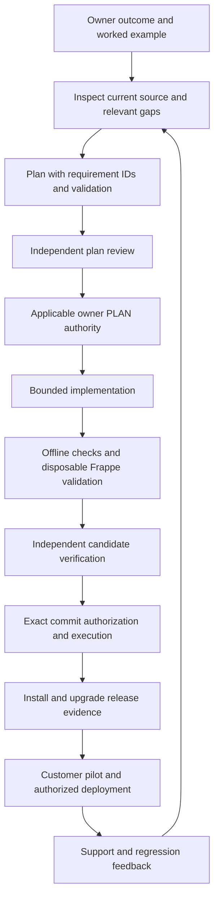

# Construction ERP — Future Development Workflow Review

**Prepared for:** Mohamed Elrefae, product owner and civil engineer

**Review date:** 2026-10-04

**Purpose:** Reconcile the existing workflow proposals, legacy plans, implemented orchestrator, and professional engineering instructions into a practical path for future feature development and customer delivery.

**Status:** Consultant assessment and recommended work packages. This document does not amend a frozen contract, authorize an operation, close a release gap, or certify the app.

## 1. Professional assessment

**Subsequent implementation, 2026-10-04:** The owner authorized a bounded delegated build with independent review and a local commit. [Engineering startup integration](work-items/engineering-startup-gates/IMPLEMENTATION.md) now enforces required instruction/context snapshots and local consistency checks for newly initialized Construction/native code tasks, with evidence bound to candidate and Git state. [Independent verification](work-items/engineering-startup-gates/REVIEW.md) records the actual coverage and remaining historical qualification failures. This addresses the startup/instruction-propagation portion of W02 and related freshness concerns. Other findings and customer release gaps remain open; existing historical checkpoints and the older controller worktree were not migrated. The source fingerprints and assessment below describe the original review baseline.

Keep the existing Frappe/ERPNext application and the useful parts of your workflow. You already have considerably more than a collection of AI prompts: independent role definitions, persistent workflow state, approval binding, candidate fingerprints, recovery controls, an owner dashboard, and substantial automated tests. Those are useful engineering assets.

However, the inspected workflow is **not yet a complete, demonstrated delivery process for a professional Frappe product**. Its strongest proof concerns controlling agents and handling one specific governed data workflow. Professional delivery also requires executable business contracts, realistic Frappe integration tests, reproducible environments, permissions verified through customer entry points, installation and upgrade checks, and recovery demonstrated after failure.

Your immediate priority should be closing those connections. A larger agent framework, more documents, or more reviewer votes would not by themselves solve the remaining problems. Continue adding bounded features after their relevant financial and permission contracts are established; prioritize the open customer release gaps before commercial delivery.

Three documents now have complementary purposes:

| Document | Purpose |
|---|---|
| [Customer release gaps](CUSTOMER_RELEASE_GAPS_2026-10-04.md) | What in the application requires correction or evidence before customer delivery. |
| [Professional engineering standard](PROFESSIONAL_ENGINEERING_STANDARD.md) | How an agent should design, implement, test, and maintain professional Frappe code. |
| This review | How the existing plans and orchestration should support that work, and which workflow gaps require attention. |

These documents are not three competing state machines. The applicable approved workflow still governs its workstream.

## 2. Scope, baseline, and evidence limits

Reviewed the complete [August workflow proposal](AI_WORKFLOW_ENHANCEMENT_PROPOSAL_2026-08-23.md), all eight documents in `docs/ai/active/`, the [canonical r5 plan](work-items/scope-context-portability/CANONICAL_PLAN.md), implementation chronology and consultant directive, role prompts, operator documentation, owner dashboard documentation, and selected implementation and tests in both checkouts.

The implementation review concentrated on workflow authority, context distribution, candidate validation, role configuration, dry-run/import behavior, recovery evidence, and CI. It is not an exhaustive audit of every engine function, dashboard endpoint, or application module.

| Snapshot | Observed baseline |
|---|---|
| Main app | `/home/mohamed/frappe-bench/apps/construction`, `develop`, HEAD `0f3bd24ba4c096104ff826c490462c47c6aaf696` during the comparison. |
| Existing controller worktree | `/home/mohamed/frappe-bench/worktrees/scope-context-portability`, `feature/scope-context-portability`, HEAD `eb30de04ab200cb8ba2288bcf80bd0c4268a9e18`, clean when inspected. |
| Relationship | Worktree HEAD is an ancestor of main, 199 commits behind at that comparison. This is a dated observation, not a maintained count. |
| Relevant source differences | 21 of 51 compared tracked orchestrator/role files differ. Main also contains later files such as the role lock. |
| Concurrent work | Main advanced from the earlier report's `48f370f` baseline through Brand onboarding; Terms and Conditions work was being staged during this review. Unrelated changes were preserved. |

During final document checks, the concurrent Terms and Conditions work was committed as `cc3a105`. Its file list does not change the inspected orchestrator sources; all six main/worktree source fingerprint pairs below were rechecked. The 199-commit comparison remains explicitly tied to the earlier baseline.

Fresh checks performed for this review:

| Check | Result | What it establishes |
|---|---|---|
| Worktree `orchestrator/tests` | **216 passed, 20 failed**, 80.43 seconds | Most offline controls pass; that checkout does not reproduce a fully green qualification on this host. |
| Main `orchestrator/tests` | **245 passed, 18 failed**, 114.46 seconds | Newer code resolves two old CLI-pin failures; historical adoption fixture failures remain. |
| Read-only SQLite `PRAGMA quick_check` on both inspected stores | `ok` | SQLite structural integrity at inspection time; not correctness of every workflow record. |
| Repository context checker | **11 passed, 0 failed** | Selected context/schema facts agree with the current checkout; not workflow or commercial correctness. |
| Isolated dry-run logic probe using synthetic rows | Unexpected current value reported, but `blocking=false`; absent parent not reported | Confirms the specific guard behavior described in W09–W10 without contacting ERP. |
| Isolated import script probe using an in-memory fake database | Changed value overwritten; commit occurred before the result was printed, including when printing raised | Confirms ordering and missing expected-value guard; not a live database crash test. |
| Dashboard suite | Not run in the original review | The dashboard uses Starlette. Its dependencies were not provisioned for that review; checking for FastAPI was not a valid readiness check. No live dashboard state was initialized. Dashboard findings here are source-based. |

The 18 shared failures are historical-service hash mismatches, rather than 18 different application defects. The two additional worktree failures concern the old expected CLI version. These failures still matter: a qualification that cannot be reproduced needs repair, even when its guard correctly refuses changed input.

Temporary local test logs: `/tmp/construction-workflow-review-worktree-20261004.log` and `/tmp/construction-workflow-review-main-20261004.log`. They are not permanent release evidence. The reported summaries should remain in this document; future qualifying runs should save their own sanitized evidence in the relevant work item.

Both fresh suites used the checkout's `orchestrator/.venv/bin/python -m pytest orchestrator/tests -q --disable-warnings --tb=short` from that checkout's repository root. All 51 local/web Markdown links were checked for local-path existence or referenced official sources; all local targets resolve. Source fingerprints below were verified against both inspected checkouts.

No native provider jobs, ERP imports, site migrations, production writes, customer HTTP tests, browser tests, load tests, or restore drills were executed by this review. No existing workflow was initialized, resumed, reconfigured, or approved. Test fixtures created disposable local repositories and files. The test counts above are workflow tests, not proof of application financial correctness.

## 3. Which plan means what today

| Source | Actual role today | Required interpretation |
|---|---|---|
| August 23 proposal | Historical design for a small, portable, repository-owned process. Some ideas landed through later work; others remain missing. | Do not implement its `STATE.json` authority alongside the later SQLite authority. Reconcile its useful unfinished requirements. |
| `docs/ai/active/` | Legacy BOQ estimation and cost-database plans, handoffs, reviews, and implementation history. | A directory named `active` does not make every recommendation a current task. Check source and later evidence before execution. |
| Canonical r5 plus applicable later owner-approved changes | Contract for the governed orchestration workstream, including gates and protected historical evidence. | Preserve locked decisions. Propose an explicit amendment when a new general-development use case needs a contract change. |
| Orchestrator SQLite checkpoints, jobs, events, grants, and accepted evidence | Runtime workflow authority for the relevant initialized work item. | Markdown verdicts and exported JSON explain state; they cannot create approval or replace the control store. |
| Current main source and installed schema | Evidence of what is implemented now. | A completed implementation or newer source can invalidate an old backlog recommendation without rewriting history. |
| September implementation/evidence documents | Historical qualification and test-site adoption records. | Preserve them. A historical successful pilot is not automatic qualification of today's changed host or source. |
| Professional engineering standard | Standing development rules in main's current working tree. | It complements governance; it does not silently change protected role prompts or grant authority. It must reach each agent's actual context. |

Two apparently conflicting ideas need explicit resolution. The August proposal says `STATE.json` is authoritative; r5 deliberately makes it an export of SQLite. Use the later approved authority for that workstream. Also, August's Phase 3 means CI enforcement, while canonical Phase 3 means a real offline pilot. Completing one does not establish completion of the other.

## 4. What is already valuable

Preserve these controls when extending the workflow:

- Separate architect, plan reviewer, builder, and verifier sessions; a builder's self-assessment does not count as independent verification.
- Stable finding IDs, routing design defects back through planning, and bounded escalation rather than endless repair loops.
- Owner PLAN authority separate from exact-candidate commit authority; specific data operations have additional bindings.
- Candidate identity that includes untracked files, deletion, file modes, and symlink targets, rather than only a convenient Git diff.
- Private content-addressed inputs, provenance, redaction, and recovery-aware records.
- An offline controller environment separated from Frappe's runtime dependencies.
- Main's later `read_only_context_paths` and immutable context snapshots, including context registration during a cycle.
- The existing local [civil engineer dashboard](CIVIL_ENGINEER_DASHBOARD_GUIDE.md). It provides inspection, task setup, scope adoption, and PLAN approval; its subprocess allowlist does not expose builder dispatch, commit, deployment, or ERP import controls.

The dashboard is owner tooling, not the customer-facing Construction ERP application. Do not turn it into a public ERP administration interface as a shortcut. Its local authentication, CSRF checks, registry, and protected-stage tests deserve their own qualification when it changes.

## 5. Workflow findings and required corrections

Priority terminology: **P1** means address before the affected risky operation or commercial delivery; **P2** means address before depending on that workflow capability; **P3** means a useful improvement after the essential gates work. Findings concern current inspected source or unresolved integration, not allegations that a past import failed.

### W01 — P2: Current entry documents do not reliably describe current implementation

**Evidence:** [Root workflow](../../AGENT_WORKFLOW.md) and [orchestrator README](../../orchestrator/README.md) still describe the initial qualification boundary, an OpenCode builder sequence, and no engine imports. Main's role configuration and import execution are newer. The [system manual](ORCHESTRATION_SYSTEM_MANUAL.md) retains an early unimplemented-import boundary, while [September 20 evidence](work-items/scope-context-portability/evidence/stage4-complete-2026-09-20.md) records test-site adoption. Explicitly dated snapshots inside a manual remain valid historical references; they must not be presented as today's state.

**Risk:** A future agent can start from contradictory instructions, repeat a completed stage, or choose the wrong process. Legacy active plans also direct readers to missing `docs/ai/AGENT_WORKFLOW.md` and `docs/ai/templates/` files. The actual workflow file is at repository root.

**Required correction:** Create one small current-status/authority index pointing to contracts, current qualified controller release, applicable work-item state, amendments, and historical evidence. Correct navigational references and present-day summaries without altering frozen contracts or historical approvals. Mark legacy active documents as historical through an index or explicit supersession note; do not erase them.

**Exit evidence:** All entry links resolve; the index agrees with the selected controller source/configuration; an agent can identify the current work item and permitted next step without inferring it from an old PASS.

### W02 — P1: Instructions and controller changes are not consistently distributed

**Evidence:** The older worktree lacks the newly written engineering standard and customer gap report, and lacks main's new AGENTS section requiring that standard. Its orchestrator differs in 21 compared files. Main [dashboard bootstrap](../../dashboard/bootstrap.py) seeds five context paths; [dashboard context summary](../../dashboard/app.py) lists the same older context set. Neither explicitly includes the engineering standard. The reports and AGENTS changes were still uncommitted when inspected.

**Risk:** An agent launched from an older worktree or a Git-created task may never receive the standards you intend it to follow. Passing AGENTS alone is insufficient if its linked guide is absent from the sandbox. Uncommitted files are not automatically present in a fresh worktree.

**Required correction:** After review and the applicable commit authorization, distribute a versioned context baseline. Use the existing read-only context snapshot mechanism to provide the engineering standard and relevant release gaps explicitly. Test readability at the actual sandbox paths. Select a qualified controller release for new tasks; do not blindly pull/rebase an old live controller or replace its state database. Reconcile/close existing state through its recovery procedure first.

**Exit evidence:** A fresh task receives the exact standard digest, source/schema context, and relevant gap IDs; required missing context blocks startup. Protected role-prompt changes, if needed, receive their required review and rebinding. Instruction propagation is demonstrated, not assumed.

### W03 — P1: Business contracts can remain ambiguous after a plan review passes

**Evidence:** [Legacy PLAN](active/PLAN.md), line 129, specifies approved **total direct unit cost** for `BOQ Item.est_unit_cost`. The [cost analysis controller](../../construction/construction/doctype/boq_cost_analysis/boq_cost_analysis.py) calculates `total_unit_cost` including overhead/profit and copies that value into the item. Item-level margins can then compound it. This corresponds to G06 in the release report and needs an owner-approved commercial policy.

The legacy final review has a regression for restoring a prior superseded analysis on cancellation. That does not cover cancellation when no prior analysis exists. The older review's scope should be respected; it is not a review of every unrelated quantity-revision endpoint.

**Risk:** Agents can agree with each other while implementing the wrong meaning of a construction term or testing only the branch they built.

**Required correction:** Every financial plan needs a short business contract with a worked calculation, authoritative source fields, rounding, approvals, edits, cancellation/deletion, and retry/concurrency behavior. Record each accepted rule against a test or explicit blocked verification. Require the reviewer to challenge meanings and omitted paths, not just check that the patch follows the plan's wording.

**Exit evidence:** Mohamed can approve the expected numbers in an example; tests independently establish them through the real document lifecycle and relevant customer entry points. Remaining uncertainty is visible as a decision, not hidden behind PASS.

### W04 — P2: The legacy cost-database backlog contains implemented and contradictory recommendations

**Evidence:** [Gap analysis](active/COST_DATABASE_GAP_ANALYSIS.md) and the long [handoff](active/COST_DATABASE_HANDOFF.md) recommend fields, repricing, and import capabilities that later source already provides: `description_ar`, category fields, bulk repricing, Arabic aliases, and cost-database imports. The handoff contains both the later implementation update and older future-work/schema statements.

Its import-role recommendation and 10 MB design limit need separate implementation checks. The current [cost database API](../../construction/api/cost_database_api.py) checks Resource Price History create permission; a listed role does not automatically satisfy that permission. The inspected endpoint does not establish the promised file-size guard. Do not broaden customer permissions simply to make the narrative match. Category aliases were adjusted to avoid a resource-type collision; copying the old alias table can reintroduce it.

Some sample rate-analysis references do not have corresponding resource rows. Example prices and source labels are not a verified commercial price catalogue. Template approval also does not automatically update a live BOQ item when no item is attached.

**Required correction:** Reconcile each backlog row as implemented, incomplete, obsolete, a business decision, or a verified defect. Preserve the history and create new bounded work items only for unresolved requirements. Keep demonstration seeds separate from a validated customer dataset with units, currency, price basis, provenance, and a defined update policy.

**Exit evidence:** No duplicate field or service is introduced because an old handoff calls it missing. A complete sample dataset imports and reconciles in a disposable site. Roles and file bounds have explicit tests.

### W05 — P1: Offline validation is not enough to verify Frappe business features

**Evidence:** [Validation runner](../../orchestrator/validation_runner.py) runs with network namespace isolation and read-only source. This is useful for deterministic offline work. It does not provision a Frappe site with MariaDB, Redis, application metadata, users, and HTTP/browser entry points. The controller environment intentionally excludes Frappe dependencies.

**Risk:** A feature can obtain excellent workflow evidence while its actual DocType lifecycle, permissions, schema migration, or client wiring remains untested.

**Required correction:** Preserve the offline runner. Add a separately governed disposable Frappe validation path or bind suitable CI results into the candidate's verification evidence. Do not disable isolation to let an ordinary agent test against a customer database. Evidence must identify candidate, Frappe/ERPNext/Python versions, site purpose, fixtures, command, return code, relevant assertions, and artifact digest.

The official [Frappe testing documentation](https://docs.frappe.io/framework/user/en/testing) uses Bench/site-aware test commands. Select commands for the installed framework version and a named disposable site. Merely running plain pytest over a site-dependent module in the controller environment is not an equivalent test.

**Exit evidence:** A real BOQ change is verified through save/submit/cancel/delete where applicable, realistic users and scope, and affected reports/UI. Source changed after validation invalidates candidate-bound evidence. An unavailable required environment produces BLOCKED, not PASS.

### W06 — P1: Qualification fixtures and CI do not yet provide reproducible coverage of the full process

**Evidence:** Both fresh orchestrator suites fail historical-service hash checks. [Adoption tests](../../orchestrator/tests/test_stage4_adoption.py) depend on a specific current main ERP service and private local catalogue paths. The older worktree additionally expects a CLI version different from the installed binary.

[Application CI](../../.github/workflows/ci.yml) sets up MariaDB/Redis, installs ERPNext and Construction, builds assets, verifies installation, and runs JS property tests. That is valuable. It does not invoke the Python business suite or orchestrator/dashboard suites. [Linter CI](../../.github/workflows/linter.yml) already performs additional static, scope, localization, and dependency checks; the issue is missing behavioral coverage, not absence of all CI. Remote branch-protection enforcement was not checked.

**Required correction:** Use immutable sanitized fixtures for historical source contracts so a clean clone can reproduce offline tests without personal private files. Keep a separate explicit compatibility test for today's adopted service. Do not update frozen hashes to silence failure, skip integrity guards, or replay protected historical ERP stages.

Add separate CI jobs/environments for controller tests, dashboard tests, and targeted/full Frappe business suites according to risk. Capture installation and upgrade results for the supported version matrix; claiming both v15 and v16 support requires evidence for both or a narrower declared support policy.

**Exit evidence:** A clean checkout on a documented host reproduces green mandatory suites; failing mandatory jobs block promotion. Historical evidence remains intact. Relevant failed tests are repaired, not omitted to make totals green.

### W07 — P2: Tool and model compatibility needs release qualification

**Evidence:** The old worktree role profile expects Codex `0.153.0-alpha.5`; the inspected installed version and newer main profile are `0.159.2`. Main has later role locks and handling fixes. Earlier implementation notes record native session failures and an owner-approved builder substitution.

**Risk:** Desktop/CLI updates or provider behavior can break resume, parsing, model availability, and sandbox assumptions independently of an application feature.

**Required correction:** Maintain a qualified controller/host profile with actual executable identity, controller revision, role/prompt bindings, dependency versions, and dated harmless capability evidence. Treat provider/model/binary changes as reviewed compatibility changes. Keep operation approval owner-executed where the permission boundary cannot be proven.

**Exit evidence:** A harmless representative native cycle validates the revised profile under its applicable approval, including interruption/resume. Synthetic tests and distinct sessions are useful evidence but do not prove every model is reliable or that reviewers are free of correlated mistakes. No native qualification was performed in this review.

### W08 — P1: Durable rollback data is saved after the import commits

**Evidence:** [Import adapter](../../orchestrator/import_adapter.py) `_WRITE_SCRIPT` calls `frappe.db.commit()` before printing its report. `import_payload()` obtains that report and only then stores the private rollback blob. The module narrative says rollback is captured before writing, but the durable export is later. Existing engine operation intents do not replace the missing durable preimage.

**Risk:** A crash, lost console output, parsing failure, or backup-storage failure can occur after ERP changes commit but before a usable rollback artifact exists. A retry may capture already-changed values as the previous values. Value-level idempotence does not preserve the first rollback baseline.

**Required correction:** Before further use of this adapter for risky imports, design durable preimage storage and a bound operation identity before applying writes, with explicit reconciliation of ambiguous outcomes. Preserve the original preimage across retries. Coordinate transaction consistency and external artifact durability; an in-memory dictionary is not durable recovery evidence. This requires a reviewed engine/data-operation work item, not an incidental feature patch.

**Exit evidence:** Disposable-site failure injection before writes, during the transaction, after ERP commit, before result capture, and during private storage persistence. Each outcome is either safely rolled back or deterministically reconciled with the original recovery data. Recovery does not blindly repeat an ambiguous operation.

### W09 — P1: The approved dry-run does not prevent overwriting later live changes

**Evidence:** [Dry-run adapter](../../orchestrator/dry_run.py) records `unexpected_current_values` but excludes that list from `blocking`. The import write script compares live values only with the proposed Arabic value; it does not require the current value to equal the approved dry-run baseline. The isolated probe demonstrated overwriting a synthetic value changed after dry-run.

**Risk:** A person's correction or another job's change can be overwritten even though the proposal and approval hashes are valid. Approving the proposal hash does not freeze database state.

**Required correction:** Define an expected-current-value policy, bind approved baseline values and target identities/site to the operation, and recheck them transactionally when applying writes. Allow already-applied values only through an explicit idempotence/recovery policy. Unexpected drift must block or receive an explicit reviewed decision; report-only warnings are insufficient.

**Exit evidence:** A second connection changes a row between dry-run and import. The operation refuses stale authorization without partially changing the batch. Legitimate retry succeeds without overwriting the original preimage or inventing new approval.

### W10 — P1: Claimed import invariants exceed the implemented checks

**Evidence:** The write script's comment claims names, codes, and parents are unchanged, but the check only verifies that `account_name` is present. It does not compare baseline English name, code, or parent. Dry-run initializes `missing_parents` but does not populate it; a parent outside the governed rows is simply accepted without an existence lookup.

**Risk:** Scope-limited writes reduce direct mutation risk, but they do not demonstrate the broader invariant claims or detect concurrent drift and invalid relationships.

**Required correction:** State the exact invariants required by the approved migration contract, then compare the relevant baseline and readback. A parent outside the governed subset can be valid; resolve it against the actual chart instead of equating outside-subset with missing. Test failed invariant handling before commit and outcome reconciliation after commit. Do not advertise this account-name adapter as a generic financial migration engine.

The official [database API documentation](https://docs.frappe.io/framework/user/en/api/database) confirms that `set_value` bypasses document validation/update triggers. A deliberately bounded data operation therefore needs its own permission, relationship, and consistency checks; the ORM will not supply them automatically.

**Exit evidence:** Synthetic and disposable-site tests detect altered English/code/parent values and nonexistent parents, while permitting valid parents outside the selected set. Evidence wording matches what was actually asserted.

### W11 — P2: Portable session capture and safe hooks remain unfinished

**Evidence:** [Session helper](../../scripts/session_end.py) hardcodes the main repository path and a personal Python 3.12 MCP package path; it imports MCP before evaluating `--no-mcp`. [Hook installer](../../scripts/install_git_hooks.sh) assumes `.git` is a directory and uses a personal interpreter for automatic external storage. A Git worktree commonly has a `.git` file. Best-effort `|| true` does not bound a hung external call. The proposed `dev_check.py` wrapper and four named playbooks were not found.

**Risk:** A supposedly local session capture can depend on unavailable external tooling, record the wrong checkout, or transmit metadata through an automatic hook. That conflicts with portability and the standing local-data instructions.

**Required correction:** Make repository discovery worktree-aware; lazy-load optional MCP only for an explicitly authorized destination; provide a reliable local-only path and bounded failures. Resolve hooks through Git's supported path discovery. Do not install or execute these hooks as part of an ordinary review.

Existing pre-commit formatting hooks can change source. Run formatting before freezing a candidate, inspect resulting changes, and regenerate verification if hooks alter it. The August desire for non-mutating fast checks needs reconciliation with this real behavior.

**Exit evidence:** Local session capture works in main and a fresh worktree with no MCP package or service. External storage failure neither blocks work indefinitely nor sends data without authorization. Optional playbooks should codify recurring real tasks after the main validation path works.

### W12 — P1: Commit verification needs a separate customer release and support contract

**Evidence:** The workflow has detailed agent/candidate and data-operation gates. These are not a complete release procedure for every customer's installed site. The [release gap report](CUSTOMER_RELEASE_GAPS_2026-10-04.md), particularly G11–G16, still requires capacity, version, installation/upgrade, and operational evidence.

**Required correction:** Add a release record identifying the exact app artifact, supported framework/runtime versions, migration plan, backup/restore evidence, customer pilot acceptance, and support owner. The delivery model is undecided; choose it before defining customer isolation and operations. A controlled initial pilot with one site/database per customer is my recommendation, pending that decision and demonstrated operations.

Installation is not equivalent to upgrade testing. [Frappe's migration reference](https://docs.frappe.io/framework/user/en/bench/reference/migrate) shows that migrate applies patches, schema, fixtures, and hooks; a clean install does not exercise all existing-customer transitions.

**Exit evidence:** An existing representative customer-like site upgrades, reconciles its business totals and permissions, and can be restored under the documented recovery procedure. A successful commit or AI verifier does not implicitly authorize deployment.

## 6. Recommended end-to-end development process

This is the target process. Parts already exist; the Frappe validation and customer release connections still need implementation. Apply it under the existing contract, and review any necessary amendment rather than silently changing its gates.

### Step 1 — Give the agent an outcome it can verify

Mohamed provides the business outcome, expected example, and boundaries. For a cost feature: quantities, direct cost, overhead, profit, currency, expected price, and what cancellation should do. For scope: which user may see/change which project/company. The technical agent converts that into a contract and questions only unresolved business choices.

### Step 2 — Reconcile before planning

Read the standard, current authority index, relevant schema/source, existing implementations, and open release gaps. Identify the approved controller profile and whether this is a governed task. Use a fresh isolated feature worktree from an intentional current base when appropriate; an old controller worktree is not automatically the right feature checkout.

### Step 3 — Plan a complete vertical feature

The plan names affected DocTypes, services, APIs, permissions, client wiring, reports, migrations, and regressions. Include requirement IDs, allowed files, known exclusions, and acceptance tests. Keep one work-item directory per task. A visual field change may need light checking; money, security, imports, and migrations need stronger evidence. The current governed contract cannot be bypassed in the name of proportionality; simplify it prospectively through an approved amendment if routine work is too costly.

### Step 4 — Review the contract and obtain applicable authority

A separate reviewer checks source/schema facts, domain meanings, edge cases, permission boundaries, and whether the proposed tests can prove the result. A PLAN grant authorizes the approved scope; it is not a commit, migration, import, or deployment grant. Ordinary repairs within an already approved plan should retain standing authority as the applicable contract permits.

### Step 5 — Implement through existing Frappe patterns

Reuse the existing service and layout architecture. Put authoritative commercial rules on the server. Respect document lifecycle, permission checks, transactions, cache invalidation, migrations, translations, and upgrade behavior. Do not add parallel abstractions simply because a prompt suggests them. The builder does not alter its running engine, role prompts, approval store, or frozen historical evidence to make its result pass.

### Step 6 — Produce two kinds of verification evidence

Offline checks establish source contracts, deterministic helpers, workflow behavior, static checks, and relevant JS properties. Disposable Frappe checks establish the real document/schema/permission behavior. Include HTTP and browser checks when the actual user path depends on them; include concurrency tests when multiple workers can affect shared state.

Keep the exact candidate and environment identity with the results. A reviewer should be able to say which assertion proves each important requirement. Do not demand a new test for a harmless wording change, and do not use a formatting check as evidence for a financial rule.

### Step 7 — Verify the exact candidate and commit under its gate

The independent verifier reviews the diff, contract, and evidence; unresolved findings keep their IDs. Repair does not become verified merely because the builder says it is fixed. After successful verification, commit exactly the authorized candidate through the approved owner operation. Inspect automatic hooks and candidate drift. Push/deploy only under their applicable authorization.

### Step 8 — Release and maintain the product

For a customer release, collect clean install, existing-site upgrade, realistic role/scope, critical business scenario, capacity, backup/restore, and pilot evidence at the release revision. Record supported versions and known limitations. When a customer reports a defect, reproduce it with sanitized data, add an appropriate regression, and ship a traceable fix. Do not turn each customer's installation into an unrelated custom branch without a maintenance policy.

## 7. Prioritized work packages

These are recommendations for new bounded tasks, not instructions to execute old stages now. Some work can proceed independently; risky data-operation reuse depends on WP-B first.

| Package | Deliverable | Completion evidence |
|---|---|---|
| **WP-A: Reconcile authority and distribute context** | Current index, valid links, versioned standard, explicit read-only context in new tasks, qualified controller selection. | Fresh sandbox can read required guides and identify actual workflow authority; old state is preserved. |
| **WP-B: Harden data-operation recovery** | W08–W10 corrections under an approved engine/import plan. | Crash, drift, retry, parent/invariant, and two-connection tests in disposable infrastructure. No historical stage replay. |
| **WP-C: Reproducible workflow qualification** | Frozen sanitized offline fixtures, current compatibility checks, qualified host profile, dashboard environment. | Clean clone passes mandatory engine/dashboard suites without personal private catalogue files; reviewed native capability evidence where required. |
| **WP-D: Frappe validation and CI integration** | Candidate-bound disposable-site testing and behavioral CI jobs; declared version matrix. | A real application lifecycle/permission defect fails verification; corrected implementation passes at the same candidate. |
| **WP-E: Correct highest-risk app gaps** | Small work items for financial lifecycle, approved history, zero-factor consistency, shared-total concurrency, cost policy, and permissions from the gap report. | Relevant gap acceptance tests pass; report status changes only with new source and evidence. |
| **WP-F: Representative feature pilot** | One real, bounded feature through the improved process, chosen after its dependencies are ready. | Contract → implementation → actual customer path → exact commit evidence. Measure owner effort and failure/repair behavior. |
| **WP-G: Commercial release qualification** | Release matrix, existing-site upgrade, recovery drill, supported delivery model, pilot/support plan. | Named technical owner signs off the demonstrated release evidence; Mohamed accepts business outcomes. |

A suitable first application exercise is a real existing defect such as the BOQ deletion/rollup issue, after checking its current implementation and dependencies. Do not create a toy feature merely to obtain a green pilot, and do not tackle billing/actual-cost expansion before the estimation and permission foundations they depend on are correct.

Useful process measures are escaped business defects, reproducibility, repair cycles, owner interventions, validation time, and release/restore success. Lines generated, prompt count, reviewer count, and percentage of Markdown marked complete are not product-quality measures.

## 8. Instructions for future AI sessions

Use the standing engineering standard as the primary coding guide. When working on this workflow or a governed feature:

1. Identify the actual checkout, branch, HEAD, unrelated changes, controller revision, and relevant work item. Do not infer them from old memory counts.
2. Read the applicable current contract, approved amendments, authoritative state, and required read-only context. If the standard is not available in the agent sandbox, expose it through the approved context mechanism before dependent development.
3. Treat `docs/ai/active/` as historical material until each relevant row is reconciled against source. An old approved plan is not a command to implement it again.
4. Preserve historical ERP evidence and sealed bindings. New application regression checks at a new release are distinct from replaying a protected historical adoption stage.
5. Record business requirement IDs and worked examples before money/security/import code. Unknown commercial policy is a decision to resolve, not a value to invent.
6. State which verification is offline, Frappe-site, HTTP, browser, migration, concurrency, or operational. Bind required results to the candidate and declare unavailable checks honestly.
7. Do not edit exported JSON/Markdown to manufacture workflow state, fabricate independent reviewer results, change frozen hashes to silence failure, or acquire owner approvals as an agent.
8. Keep ordinary implementation and engine improvements in separate scoped work items. Do not modify the running controller to unblock a feature it is judging.
9. Prepare reviewable work before requesting a genuinely required final approval. Keep existing standing approval for in-scope repairs where the contract allows it.
10. End with changed behavior, evidence, remaining limitations, and the next genuine decision. Update local handover notes; external memory requires an authorized destination and scope.

For a new task, a concise owner brief can be:

> Deliver [business outcome] for [users] in [workflow]. The expected construction example is [inputs and expected result]. Read the professional standard and applicable governed workflow. Reconcile existing code first. Plan and verify the full affected server/client/report path with proportionate evidence. Preserve unrelated work and historical records. Do not claim readiness beyond checks actually performed; prepare any separately gated operation for final owner approval.

This brief supplements repository instructions. It does not override existing locked decisions or provide deployment/import authorization.

## 9. What Mohamed should own, and where a technical reviewer is needed

You should own construction terminology, financial examples, workflow suitability, customer requirements, and business acceptance. Ask the agent to show you the numbers and the screen/report outcome. You do not need to approve every internal helper function or repeatedly reauthorize routine repairs.

Learn enough Git to distinguish branch, dirty files, commit, and release; enough Frappe lifecycle to distinguish draft, submit, cancel, and delete; and enough testing to ask what a passing test actually proves. This will help you supervise AI output more effectively than memorizing large quantities of syntax.

Before the first paying customer, obtain a named technical reviewer/support owner who can evaluate transactions, permissions, migrations, environment compatibility, and recovery. AI reviews remain useful, but a set of AI PASS results is not a substitute for demonstrated behavior and accountable technical operations. Review that person's evidence and deliverables rather than purchasing a vague claim that the app is professional.

## 10. Evidence index and source fingerprints

Primary local sources:

- [August proposal](AI_WORKFLOW_ENHANCEMENT_PROPOSAL_2026-08-23.md).
- Legacy active [plan](active/PLAN.md), [review](active/REVIEW.md), [build handoff](active/BUILD_HANDOFF.md), [review handoff](active/REVIEW_HANDOFF.md), [final diff](active/FINAL_DIFF.md), [implementation](active/IMPLEMENTATION.md), [cost gap analysis](active/COST_DATABASE_GAP_ANALYSIS.md), and [cost handoff](active/COST_DATABASE_HANDOFF.md).
- Governed [canonical plan](work-items/scope-context-portability/CANONICAL_PLAN.md), [consultant directive](work-items/scope-context-portability/CONSULTANT_DIRECTIVE_2026-09-11.md), [implementation](work-items/scope-context-portability/IMPLEMENTATION.md), and [stage-3 supersession record](work-items/scope-context-portability/STAGE3_IMPLEMENTATION_PLAN.md).
- [Main engine](../../orchestrator/engine.py), [role configuration](../../orchestrator/roles.json), [validation runner](../../orchestrator/validation_runner.py), [dry-run](../../orchestrator/dry_run.py), and [import](../../orchestrator/import_adapter.py).
- [Main dashboard](../../dashboard/app.py), [bootstrap](../../dashboard/bootstrap.py), [subprocess allowlist](../../dashboard/subprocess_client.py), and [dashboard tests](../../dashboard/tests).
- [Older worktree](../../../../worktrees/scope-context-portability), including its controller, roles, instructions, and local state inspected read-only.

SHA-256 fingerprints below anchor the two inspected versions. Changes after this review require rechecking affected findings.

| Source | Main | Older worktree |
|---|---|---|
| `orchestrator/engine.py` | `31b22ed232b5c9304698c1623e5eb223cfc26ceb43dc65b906169d332d41df42` | `8a8304686210552e086ccb2825669a109e40716bf46b7e5b6cb7310975e12e72` |
| `orchestrator/import_adapter.py` | `f8ff7eb5c9c3f04b748b6180eab41c22c5eb1bd42b04d7647cc665e84cc55832` | `fbafdab6f385ac7edbb9a78800ae2508a5ef2495167f43026d3a6071221186c3` |
| `orchestrator/dry_run.py` | `7d74fa8cdd9c6679587f1a3b364eff0a19146793eba41c1ce4e5b1ed8d4993c2` | `b811df00180b30464afdcd8dfe8ffbe3b2887e1681a403c994e0c2219ca719ab` |
| `orchestrator/validation_runner.py` | `ebdbf6a277115d2e93417e8593070f10230d6a69dc4e981255db80921547288f` | `5a0c2b82843b315c748e7a2313cc454a723a1e861acf2a0f2034a2c8bfe9cb17` |
| `orchestrator/stage4.py` | `c1e96fde4acb6c8baf82058cb17d80767d61830089bfdff3731e94a782c9569a` | `6685fd8b22b51bd3ed3784733b6670d08d78dcf62ae6a80c37432815e1807d70` |
| `orchestrator/roles.json` | `2e1d6a425022426f2b16644e6b5859605634e8ab2bb98f556123721244ab8686` | `f987dea467f50d74fe9169295ad6ecd5ca6e5822c52624dc400a10eccbdeeb79` |

Official framework references were checked on the review date. Their general guidance does not replace verifying behavior against the exact installed Frappe/ERPNext versions.
