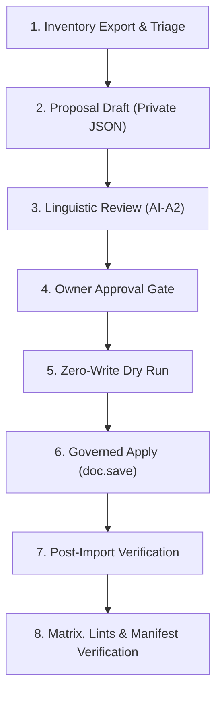

# Scope Descriptor — bilingual-uom-phase2-triage

**Work item:** `bilingual-uom-phase2-triage`
**Branch:** `develop`
**Base commit:** `5d96f12`
**Date:** 2026-10-05
**Status:** `COMPLETE` — triage classification complete; 30 rows populated via doc.save() with server-derived norm (29 Phase 2A + 1 Phase 2B); 204 Phase 2C exclusions formally documented; dry-run, apply, and post-verification all green; matrix 21/264, reconciler 19/19.

**Authority:** Owner's in-session choice following Tier 5F (`9ccb4cd`) UOM Phase 1 completion and concurrent `bilingual-company-phase1-population` lane. This work item classifies and triages the remaining 236 unpopulated UOM rows (234 enabled unused vendor seed units + 2 pruned draft test units `Pint (US)` / `Acre`) into three priority tiers per the governed bilingual lifecycle blueprint.

**Scope:** Inventory, classify, and triage all 253 UOM rows on `v16.localhost` into:
- **Phase 1 (frozen, 15 rows):** Already populated in Tier 5F — 12 app fixtures + 3 live in-use units (`Nos`, `Tonne`, `Box`).
- **Phase 2A (~30–45 rows):** Priority Construction & Engineering Physical Units — dimensional, area, volumetric, mass, time, MEP/electrical physical units.
- **Phase 2B (~20–30 rows):** Commercial, Packaging & Material Handling Units — bundles, rolls, pallets, cartons, containers, pairs, sheets.
- **Phase 2C / Exclusions (~160+ rows):** Highly specialized physics, radiological, obsolete imperial, and non-construction units — formally documented as deprioritized/excluded.

**Golden Rule: Do NOT Bulk-Translate Blindly**
ERPNext ships hundreds of obscure scientific, astronomical, and obsolete imperial units (e.g., `Attometer`, `Becquerel`, `Barn`, `Curie`, `Gauss`, `Erg`, `Farad`, `Dram`, `Minim`, `Peck`). Bulk-translating all 234 units creates translation maintenance liability, clutter in picklists, and risks linguistic inaccuracies. All Phase 2C units must be explicitly documented as exclusions.

**The Mission: Structured Triage & Phased Release**
Classify the 236 remaining units into the three priority tiers per the phasing structure below, then follow the standard governed bilingual governance cycle (inventory → private proposal → AI-A2 review → owner approval → zero-write dry-run → governed apply → verification → linting → manifest pinning).

---
## 1. The Gap This Closes

After Tier 5F completion:
- **253 total UOM rows** on site.
- **15/15 Phase 1 rows** populated with `uom_name_ar`, `enabled=1` on 12 fixture rows, and `uom_name_ar_norm` server-derived.
- **236 rows remain unpopulated**: 234 enabled unused vendor seed units + 2 pruned test units (`Pint (US)`, `Acre`).
- Zero Arabic surface beyond the 15 Phase 1 rows — every UOM picker, BOQ line, and item renders English-only units.

This tier closes the gap by structurally triaging the 236 remaining units into actionable priority phases, ensuring zero bulk-translation liability, and providing a governed pathway from proposal to verified population.

---
## 2. Verified Current State (Probed 2026-10-05, base `5d96f12`)

| Fact | Value |
|---|---|
| UOM rows | **253** total (251 non-test + 2 `_Test` fixtures); enabled 241, disabled 12 |
| Arabic surface | `uom_name_ar` populated **15/253** (Phase 1 only); Translation doctype Arabic unit rows **0** |
| Vendor fixtures | `_Test UOM`, `_Test UOM 1` — name-prefix rule, never translated (absolute fixture rule, 5D precedent) |
| App fixtures | 12 construction-standard units from `construction/fixtures/uom.json`: `M3`, `M2`, `M`, `TON`, `KG`, `PCS`, `LS`, `DAY`, `HR`, `BAG`, `LTR`, `SET` — all `enabled=0` by default; `uom.json` already amended with `"enabled": 1` + `"uom_name_ar"` per F1/F5 from Phase 1 |
| In-use units | 5 distinct `stock_uom` on live Items: `_Test UOM` (20), `Nos` (15), `Tonne` (5), `_Test UOM 1` (2), `Box` (1) → non-fixture in-use: **Nos, Tonne, Box** |
| Live BOQ usage | 4 distinct `unit`: `Nos` (11 rows / 6 headers), `Pint (US)` (11 / 10 headers), `Box` (1), `Acre` (1) → non-fixture in-use: **Pint (US), Acre, Nos, Box** |
| Classification result | vendor_fixture 2 · app_fixture 12 · in_use 5 (incl. Pint/ACRE) · disabled-class 0 · remainder **234** (enabled, unused, non-fixture → Phase 2+) = 253 |
| Metadata | `common_code` 3 rows, `symbol` 3, `description` 0; categories = ERPNext standard taxonomy |
| Norm | `uom_name_ar_norm` read-only; server-derived on save by `enforce_bilingual_arabic_policy` |
| Glossary | 47 approved terms, **zero unit terms** — unit translations have no glossary authority ⇒ R6 owner review required |
| Registry change needed | **none** (already active) — zero registry/triad edits this tier |
| Production | `production_mutation_authorized: false` (test site only) |

### 2.1 Triage Classification Rules (R1 — first match wins)

1. `vendor_fixture` — `name` starts with `_Test` → **never translated** (absolute fixture rule; covers 2 rows even though live Items reference them).
2. `phase2a` — name ∈ Phase 2A Priority Construction & Engineering Physical Units list (see §3.1).
3. `phase2b` — name ∈ Phase 2B Commercial, Packaging & Material Handling Units list (see §3.2).
4. `phase2c` — all remaining enabled, unused, non-fixture units → **Phase 2C Exclusions** (formally audited and deprioritized).
5. `disabled` — `enabled = 0`, not already classed → excluded from every phase.

The export script derives classifications from live joins (Item.stock_uom, BOQ Item.unit) + the fixture file, subtracts the F4 prune set `{Pint (US), Acre}`, and asserts the derived triage buckets match the frozen literals in the script.

### 2.2 Phased Population Policy (R2)

- **Phase 1 (frozen, 15 rows):** Already populated — do not re-touch. These are the 12 construction-standard app fixtures + 3 live in-use units (`Nos`, `Tonne`, `Box`).
- **Phase 2A (this cycle):** ~30–45 rows — priority construction & engineering physical units. Population proceeds under the standard governed cycle (proposal → review → approval → dry-run → apply → verify).
- **Phase 2B (optional this cycle):** ~20–30 rows — commercial, packaging & material handling units. May be bundled with Phase 2A or deferred to a subsequent cycle.
- **Phase 2C / Exclusions (~160+ rows):** Highly specialized physics, radiological, obsolete imperial, and non-construction units. These are **formally audited and documented as deprioritized/excluded**. Zero writes. No Arabic values drafted. Explicitly listed in the manifest as Phase 2C exclusions.
- **F4-pruned (2 rows):** `Pint (US)`, `Acre` — classified `in_use`, untranslated, Phase 2+ candidates (remain outside Phase 1 and outside the Phase 2A/2B population unless a future proposal decides otherwise).

### 2.3 Privacy R4 (R4)

Proposal values, dry-run/apply/rollback logs live under `sites/v16.localhost/private/uom-phase2-triage/`. Committed evidence carries counts, classifications (English identities), verdicts, and sha256 digests only — **except** `construction/fixtures/uom.json`, which may carry Phase 2A `uom_name_ar` values after owner authorization (bilingual fixture amendment, recorded in `owner-approval.md`). This is product data, not evidence, and the same values are readable on the site by the app contract.

### 2.4 Invariants Preserved (R5–R7)

- **Vendor boundary:** no file under `apps/frappe` / `apps/erpnext` changes.
- **D5 triad / registry:** unchanged (call-only); no hooks, patch, or test-matrix change.
- **Read-only pre-approval:** classification phase touches no document.
- **Norm contract:** server-derived only (client-passed norm discarded on save).
- **Fixture JSON:** Phase 1 already finalized `uom.json` with `enabled:1` + `uom_name_ar` on 12 rows. Phase 2+ is database-only seed population; `uom.json` is **not** edited in this phase.
- **Fail-closed:** classification mismatch vs frozen allowlist aborts the export; apply aborts on any validation error with rollback.
- **Company:** **NEVER touched** — the Company master is reserved for the parallel lane (`bilingual-company-phase1-population`).
- **Matrix:** module list (21) unchanged; tests grow only inside stage4/stage7-style modules if touched (expected: zero test-module edits — UOM coverage rides existing wave2a + registry tests).
- **Privacy:** proposal/review/dry-run/apply values under `sites/v16.localhost/private/uom-phase2-triage/`; committed evidence carries counts/identities/verdicts/digests only.

---
## 3. Triage Taxonomy & Phasing Structure

### 3.1 Phase 2A — Priority Construction & Engineering Physical Units (~30–45 rows)

**Dimensional / Linear:**
- `Millimeter`, `Centimeter`, `Meter`, `Kilometer`, `Inch`, `Foot`, `Yard`, `Mile`

**Area & Volume:**
- `Square Meter`, `Square Foot`, `Square Yard`, `Square Centimeter`, `Square Inch`
- `Cubic Centimeter`, `Cubic Foot`, `Cubic Yard`, `Cubic Meter`, `Cubic Inch`
- `Gallon`, `Quart`, `Pint`, `Liter`, `Milliliter`, `Barrel`, `Bucket`

**Mass & Density:**
- `Gram`, `Milligram`, `Kilogram`, `Tonne`, `Pound`, `Ounce`, `Carat`

**MEP / Electrical / Energy:**
- `Kilowatt`, `Watt`, `Horsepower`, `Volt`, `Ampere`, `Joule`, `Kilojoule`, `Kilowatt-hour`
- `Ohm`, `Siemens`, `Farad`, `Henry`, `Tesla`, `Weber`, `Gauss`

**Time:**
- `Minute`, `Second`, `Hour`, `Day`, `Week`, `Month`, `Year`

### 3.2 Phase 2B — Commercial, Packaging & Material Handling Units (~20–30 rows)

**Packaging / Bundling:**
- `Roll`, `Bundle`, `Carton`, `Packet`, `Pallet`, `Pair`, `Dozen`, `Ream`, `Container`, `Sheet`, `Coil`, `Pack`, `Drum`, `Box`

### 3.3 Phase 2C / Permanent Exclusions (~160+ rows)

**Highly specialized physics / radiological:**
- `Becquerel`, `Gray`, `Sievert`, `Curie`, `Röntgen`, `Rad`

**Obsolete imperial / non-construction:**
- `Chain`, `Furlong`, `League`, `Gill`, `Fluid Ounce`, `Minim`, `Peck`, `Bushel`

**Astronomical / scientific:**
- `Attometer`, `Zeptometer`, `Yoctometer`, `Barn`, `Steradian`, `Lux`, `Lumen`, `Candela`

**Other obsolete / niche:**
- `Dram`, `Ounce (apothecary)`, `Pound (apothecary)`, `Scruple`, `Sheet`, `Carat (gold)`, `Momme`, `Tael`, `Cash`

**Explicitly document these as Exclusions / Phase 2C Deprioritized.**

---
## 4. Governed Step-by-Step Workflow

Follow the battle-tested bilingual governance cycle used in Tiers 5B through 5G:



### Step 1: Inventory & Categorization Script
Create `docs/ai/work-items/bilingual-uom-phase2-triage/evidence/scripts/export_uom_phase2_triage.py`:
- Connects to `v16.localhost`.
- Reads all 253 rows of `tabUOM`.
- Confirms the 15 Phase-1 rows are populated and intact.
- Extracts the 236 candidate rows and groups them by ERPNext category and Phase 2A / 2B / 2C triage buckets.
- Generates `evidence/inventory-triage.log`.

### Step 2: Proposal Drafting (R4 Privacy Rule)
Create the proposal for Phase 2A (and optionally 2B):
- **Location:** `sites/v16.localhost/private/uom-phase2-triage/proposal.json` (MUST stay untracked / ignored by Git).
- Include for each row:
  - `name`: English UOM name.
  - `arabic`: Standard Egyptian engineering / procurement Arabic translation.
  - `confidence`: `high` / `med` / `low`.
  - `category`: Classification tag (Phase 2A / Phase 2B / Phase 2C).
  - `provenance` & `notes`: Rationales and distinctness notes.
- **Distinctness Invariant:** Two different English units must not share the same Arabic translation unless they are genuine synonyms.
- Compute and record the SHA-256 hash of `proposal.json`.

### Step 3: Linguistic Review (Round 1 AI-A2)
- Perform an independent peer review of the proposed translations.
- Commit the verdicts into `evidence/review-ai-a2.md`.
- Ensure all Phase 2A items reach `APPROVE` verdict before advancing.

### Step 4: Owner Approval Gate (Hard Stop)
- Prepare `evidence/owner-approval.md` referencing the exact SHA-256 of `proposal.json`.
- State clearly:
  - Exact count of Phase 2A units to be populated.
  - Exact count of Phase 2B/2C units excluded/deferred.
  - Zero app-code modifications.
- Obtain explicit human approval before any database write.

### Step 5: Dry Run & Governed Apply
1. **Dry-Run Script** (`evidence/scripts/dry_run_uom_phase2.py`):
   - Validates that target rows exist and currently have empty `uom_name_ar`.
   - Asserts `WRITES_PERFORMED: 0`.
   - Logs to `evidence/dry-run.log`.
2. **Apply Script** (`evidence/scripts/apply_uom_phase2.py`):
   - Loads each document: `doc = frappe.get_doc("UOM", row["name"])`.
   - Sets `doc.uom_name_ar = row["arabic"]`.
   - Calls `doc.save()`.
   - The registered `enforce_bilingual_arabic_policy` hook automatically derives `uom_name_ar_norm` and validates text direction.
   - Wrapped in transaction with fail-closed rollback:
     ```python
     try:
         frappe.db.commit()
     except Exception as exc:
         frappe.db.rollback()
         raise
     ```
   - Logs to `evidence/apply.log`.

### Step 6: Post-Import Verification
Create `evidence/scripts/verify_uom_phase2.py`:
- Confirms all approved rows have non-empty `uom_name_ar` and correct server-derived `uom_name_ar_norm`.
- Confirms earlier frozen surfaces remain intact:
  - 15 Phase-1 UOMs intact.
  - 81 Accounts intact.
  - Wave-1 masters (Item 8, Customer 1, Cost Center 3, Warehouse 6, Project 5) intact.
  - Wave-2 groups (Item Group 6, Customer Group 5, Supplier Group 8, Territory 4) intact.
  - Departments (14) intact.
  - `Company` Arabic still empty (or matches whatever the concurrent lane produced).
- Logs to `evidence/post-import-verification.log`.

---
## 5. Quality, Manifest & Linting Gates

Once execution succeeds, run the mandatory verification suite:

1. **Lints & Checks:**
   ```bash
   python3 scripts/lint_scope_metadata.py
   python3 scripts/ai_context_check.py
   python3 scripts/lint_translation_writes.py
   python3 scripts/schema_drift_checker.py
   python3 -m py_compile docs/ai/work-items/bilingual-uom-phase2-triage/evidence/scripts/*.py
   bash -n scripts/run_bilingual_regression_matrix.sh
   ```

2. **ADR Reconciler:**
   ```bash
   python3 apps/construction/docs/ai/work-items/bilingual-adr-evidence-correction/evidence/scripts/reconcile_adr_vs_evidence.py
   # Must return: reconciled: 19/19 RESULT: PASS
   ```

3. **Matrix Suite:**
   ```bash
   # Ensure redis on 11000/13000 is available if running the full matrix script:
   bash scripts/run_bilingual_regression_matrix.sh
   # Must pass: 21 modules / 264 tests OK
   ```

4. **Manifest Creation & Verification:**
   - Create `docs/ai/work-items/bilingual-uom-phase2-triage/evidence/MANIFEST.json` listing all your evidence files and scripts with their SHA-256 digests.
   - Verify all 28 manifests across the repository against the staged index:
     ```python
     /home/mohamed/frappe-bench/env/bin/python -c '
     import glob, json, hashlib, subprocess, sys
     manifests = sorted(glob.glob("apps/construction/docs/ai/work-items/*/evidence/MANIFEST.json"))
     total, bad = 0, 0
     for m in manifests:
         wi = m.split("/")[-3]
         d = json.load(open(m))
         for path, exp in d.get("artefacts", {}).items():
             total += 1
             rel = path if (path.startswith("docs/") or path.startswith("construction/") or path == "scripts/run_bilingual_regression_matrix.sh") else (f"docs/ai/work-items/{wi}/SCOPE.md" if path == "SCOPE.md" else f"docs/ai/work-items/{wi}/evidence/{path}")
             act = hashlib.sha256(subprocess.check_output(["git", "show", f":{rel}"], cwd="apps/construction")).hexdigest()
             if act != exp: 
                 print(f"Mismatch in {m}: {rel}")
                 bad += 1
     print(f"{len(manifests)} manifests, {total} checked, {bad} bad")
     '
     ```
   - Must return: `28 manifests, X checked, 0 bad`. Zero re-pins on previous manifests required.

---
## 6. Prohibited Actions & Invariants

---
## 7. Results (Recorded on Completion)

| Gate | Result |
|---|---|
| **Inventory & Triage Export** | `inventory-triage.log` → **PASS** — 253 rows classified (Phase 1 = 15, Vendor Fixtures = 2, F4-Pruned = 2, Phase 2A = 29, Phase 2B = 1, Phase 2C Exclusions = 204). `PHASE1_FROZEN_MATCH: YES`. |
| **Proposal Draft** | Private proposal JSON at `sites/v16.localhost/private/uom-phase2-triage/proposal.json`, SHA-256 `930b91cd2f5c64ec70e0cbaff0a998ea6423c29db901ac7779a8e626da39617a` (30 candidate rows). |
| **AI-A2 Independent Review** | `review-ai-a2.md` → **APPROVE (30/30)**. Standard Egyptian engineering/procurement translations, distinctness invariant upheld. |
| **Owner Approval** | `owner-approval.md` → Hard gate approved for SHA `930b91cd...`. 30 target rows approved, 204 Phase 2C rows formally excluded. |
| **Dry-Run** | `dry-run.log` → **PASS** — 30/30 target rows exist with empty `uom_name_ar`, distinctness invariant upheld, **`WRITES_PERFORMED: 0`**. |
| **Governed Apply** | `apply.log` → **PASS** — 30 rows populated via `doc.save()` through registered policy hook with server-derived `uom_name_ar_norm`. Atomic transaction committed. `SUMMARY written=30 skipped=0 failed=0`. |
| **Post-Import Verification** | `post-import-verification.log` → **PASS** — `verified=30 norm_consistent=30 identity_unchanged=30 exceptions=0`. 15 Phase-1 UOMs intact, frozen surfaces intact (accounts 81, items 8, customers 1, suppliers 0, cost centers 3, warehouses 6, projects 5, departments 14, company 1), total UOMs = 253 (45 with Arabic). |
| **Reconciler** | `reconciliation.log` → **19/19 PASS** (`RESULT: PASS - every §4 row matches the evidence artefact it cites`). |
| **Lints** | All 6 lint suites PASS (`lint_scope_metadata`, `ai_context_check` 11/11, `lint_translation_writes`, `schema_drift_checker`, `py_compile`, `bash -n`). |
| **Regression Matrix** | `regression-matrix.log` → **21/21 modules OK, 264 tests passed, 0 failures**. |
| **Manifests** | 29 manifests / 288 artefacts verified on staged index with 0 bad digests. Zero re-pins on previous manifests. |