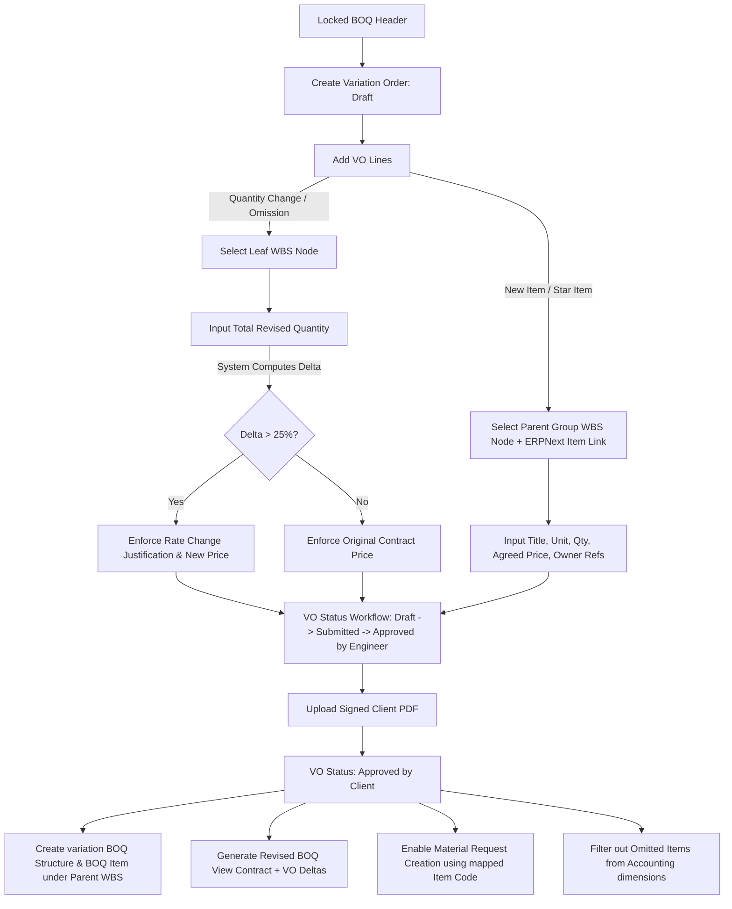

# Variation Order Engineering & Implementation Report

**To:** Lead Software Consultant  
**From:** Senior Construction ERP Systems Engineer  
**Date:** June 10, 2026  
**Subject:** Technical Review and Approval Request for Variation Order (VO) Implementation  

---

## 1. Executive Summary

This report outlines the design and implementation specifications for the **Variation Order (VO) / Change Order** module in the Construction ERP app. The implementation is designed to meet the strict regulatory and practical requirements of the **Egyptian and Gulf (MENA) construction markets**. 

Under MENA project governance (governed primarily by the **FIDIC Red Book Conditions of Contract**), the Bill of Quantities (BOQ) is a legally binding document. Once the contract is signed and the BOQ is locked, any subsequent deviations—whether quantity increases, decreases, omissions, or new works—must be processed via a structured, auditable Variation Order workflow.

This module guarantees:
1. **Contract Integrity**: The original contract BOQ remains completely immutable.
2. **Dynamic Scope Adaptation**: Approved changes are modeled as a "Revised BOQ" overlay (Contract + approved VO deltas).
3. **WBS Consistency**: New star items are properly nested under existing WBS groups.
4. **Direct Cost Attribution**: Integration with ERPNext transactional child tables (Material Requests, Purchase Orders) remains fully functional, while fully omitted items are hidden to prevent accidental bookings.

---

## 2. Market Practice vs. ERP Software Design

Construction project controls in Egypt, Saudi Arabia, and the UAE rely on a clear separation between contract scope items and operational resources. 

### 2.1. The Role of the WBS (Work Breakdown Structure)
In tools like Candy CCS or Primavera P6, a surveyor never selects a contract item from a flat list. They navigate the WBS tree.
- **Quantity Change / Omission**: Target an existing leaf WBS node.
- **New Item ("Star Item" / بند مستجد)**: Created under an existing group WBS node (e.g. adding a new type of granite tiling under the "02.03 Finishing Works" group).
- **Implementation**: The `VO Line` child table is enhanced to link directly to a `boq_structure` WBS node. The client-side controller filters this dynamically: leaf nodes (`is_group = 0`) for existing item modifications, and group nodes (`is_group = 1`) to act as the parent for new items.

### 2.2. Quantity Surveying vs. Delta Input
Surveyors measure the *total revised work quantity* on site. 
- **Implementation**: The `VO Line` schema is updated to make `revised_qty` editable. The UI automatically calculates `delta_qty = revised_qty - contract_qty` in real-time, allowing the surveyor to work in terms of total revised measurements, while the system records the delta.

### 2.3. The 25% Threshold Rule (FIDIC Clause 12.3)
Under FIDIC standard contracts, if the quantity of a BOQ item changes by more than 25%, and the contract value of this change exceeds a specific threshold, a new rate (unit price) must be agreed upon.
- **Implementation**: The server-side controller `vo_line.py` checks `abs_change_pct = (abs(delta_qty) / contract_qty) * 100`. If it exceeds 25%, the system triggers `rate_change_triggered = 1`, making `revised_unit_price` and `rate_change_justification` mandatory fields. If it is <= 25%, the contract unit price is strictly enforced.

### 2.4. Star Item Metadata (Owner References)
New variation items must trace back to the owner's instruction letters, drawings, or page numbers.
- **Implementation**: We have added `owner_page`, `owner_ref_no`, and `owner_file_ref` to the `VO Line` child table. When the client approves the VO, these are copied directly into the newly created `BOQ Item`.

### 2.5. Omission Cleanup (Accounting Dimensions)
When an item is completely omitted (`revised_qty = 0`), it should no longer be available for cost allocation in Purchase Orders, Material Requests, or Journal Entries.
- **Implementation**: The database query `get_boq_items` dynamically calculates the revised quantity (Contract Qty + approved VO deltas) using a subquery. If the revised quantity of an item is `0`, it is automatically excluded from search results, preventing direct bookings.

---

## 3. Technical Architecture & Data Flow

The diagram below illustrates the lifecycle of a Variation Order and how it integrates with the WBS tree and standard ERPNext transactions:

---

## 4. Proposed Schema & Controller Code Changes

For details on the exact files and code modifications, please refer to the accompanying [Implementation Plan](file:///home/mohamed/.gemini/antigravity/brain/7aa0849d-6ef1-496b-b74e-91816b9e488f/implementation_plan.md).

The changes will be verified using the automated test suite in `test_variation_orders.py` and manually run against the `v16.localhost` staging site before promotion.

---

## 5. Consultant Sign-off

Please review the proposed design. If you agree that this design meets the contract management and auditing requirements of our region, please provide your approval so that the engineering team can begin coding.

**Approved By:** ___________________________  
*(Software Consultant)*  
**Date:** ____ / ____ / ________  
