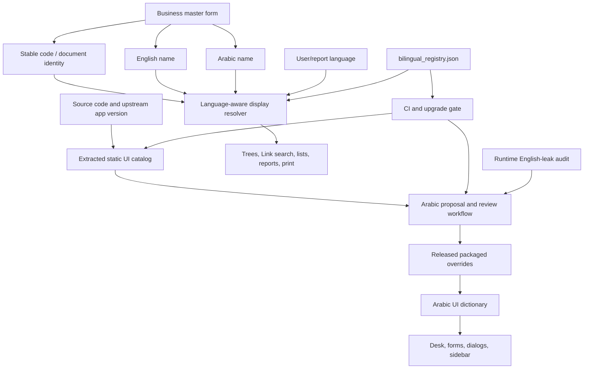

# ERP Arabic UI and Bilingual Business Data — End-to-End Plan

**Document status:** Revised v4 — owner-approved AI review governance; codebase-evidence corrections applied; ready for continued implementation.
**Prepared:** 2026-09-04 (Africa/Cairo)
**Revised:** 2026-09-04 — v4 replaces four named-human review/signature requirements with an independent AI review panel while retaining explicit owner authorization for production mutations
**Target:** Frappe 16.18.1, ERPNext 16.18.3, Construction `develop`, site `v16.localhost`
**Primary outcome:** Arabic users see an operationally complete Arabic ERP, while Arabic and English users can create, find, display, print, and safely maintain the same business records in their own language.

---

## Owner-Confirmed Decisions

The following decisions are confirmed and locked before engineering begins:

| # | Decision |
|---|---|
| D1 | `account_name_ar` is a **Construction-owned custom field on the ERPNext `Account` DocType** — no upstream modification. |
| D2 | Account form override uses the **`doctype_js` hook** — `construction/construction/doctype/account/account.js` with `frappe.ui.form.on` — not a database `Form Custom Script`. |
| D3 | Bilingual registry is a **checked-in JSON file** (`construction/data/bilingual/bilingual_registry.json`) — not a Frappe DocType. |
| D4 | Pilot migration scope is the **81 active accounts for company `Elrefae`** — test/demo company accounts are explicitly excluded from the filter. |
| D5 | Stage 4 data review uses an **AI proposal plus independent AI review-panel process**. AI-A1, AI-A2, and AI-A3 must independently approve or record an exception for every applicable row; AI-R verifies the exact evidence bundle. No named-human reviewer/signature is required. See §D4 and §7.4. |
| D6 | Actual production mutation, deployment, commit, push, or merge still requires the owner's explicit operational authorization. This is permission to act, not a linguistic/domain reviewer signature. |

---

## 0. Consultant Verdict

The screenshot does not show one translation defect. It shows three independent localization gaps that must be solved together:

1. **Static software UI:** labels such as `Desktop`, `Workspaces`, `Edit Sidebar`, `Toggle Theme`, and `Toggle Full Width` are translatable software strings, but their current Arabic Frappe catalog entries are empty and no released runtime override covers them.
2. **Business/master data:** account titles such as `Current Assets`, `Cash In Hand`, and `Stock Assets` are database values, not `.po` messages. Translating the software catalog cannot translate these records.
3. **Presentation and usability:** the tree combines English record names, codes, company abbreviation, currency, and debit/credit markers. Account name/number maintenance is hidden in the Actions menu instead of presented as a controlled identity section on the form.

The correct programme therefore has two coordinated products:

- a governed Arabic UI localization pipeline; and
- a reusable bilingual-data framework, piloted on the Chart of Accounts and then applied to selected master data.

It is **not** correct to add Arabic and English copies of every database field. Codes, dates, numbers, statuses, links, and system identifiers are language-neutral. Dual-language fields are required for user-visible names and selected narrative text where the business, legal, search, or print use case needs both languages.

### 0.1 Verified current baseline

The following was verified against the current checkout and live site on 2026-09-04. All evidence must be regenerated against the exact candidate commit before any stage gate:

| Evidence | Current result | Consequence |
|---|---:|---|
| Frappe Arabic catalog | 5,902 total; 2,905 translated; **2,997 empty** | Framework UI will still leak English. |
| ERPNext Arabic catalog | 8,997 total; 4,655 translated; **4,342 empty** | ERPNext modules will still leak English. |
| Construction Arabic catalog | 207 total; 207 translated; 0 empty | Construction-owned extracted strings are covered, subject to browser and linguistic QA. |
| Combined current catalogs | 15,106 total; 7,767 translated; **7,339 empty** | Historical 100% coverage is not the current state. |
| Exact screenshot strings in compiled `.mo` files | Missing for the five Frappe strings above and `Typography Settings` | Cache clearing cannot create translations absent from runtime catalogs/overrides. |
| Translation subsystem health | Loader/constraint/duplicate/drift checks pass | Technical integrity passes, but health does not measure linguistic coverage or `.mo` freshness. |
| Elrefae Chart of Accounts | **81 active accounts; 0 names containing Arabic** | A data migration and bilingual schema are required. |
| `tabAccount` schema | `account_name`, `account_number`; **no `account_name_ar`** | Arabic account names have nowhere to be stored. Searchable-dropdown JS already references this absent column. |
| Saved Account form | Core JS hides `account_name`; rename is in Actions | The form usability change is valid. |
| Existing bilingual fields | `item_name_ar` on Item (custom field, patch v8_0); `customer_name_in_arabic` and `supplier_name_in_arabic` on Customer/Supplier | Reuse through registry adapters; do not create duplicate columns. |
| BOQ bilingual print | Feature-flagged via `enable_bilingual_boq_print` in Construction Settings | Gate exists; wiring to print output is partial; finalize in Wave 1/Pilot. |
| Translation stabilization infrastructure | Catalog workbench, digest uniqueness, quorum enforcement, drift detection, health API, translation tests implemented | **Reuse — do not rebuild.** See §0.3 for scope and re-validation requirement. |

The May 2026 catalog statistics and production report are historical snapshots. They must not be used as current release evidence. The stabilization record correctly preserved clean vendor catalogs and released only a small approved runtime set; it did **not** linguistically complete all 15,106 current strings.

### 0.2 Disposition of the independent engineering review

An independent engineering review was evaluated against the current repository. Its useful discoveries are incorporated below, with these corrections:

| Review proposal/claim | Consultant disposition | Reason |
|---|---|---|
| Translation stabilization is "production-ready" | **Corrected — revalidate before relying on it** | Its technical controls are sound and reusable, but its sign-off evidence predates later commits. Re-run tests and evidence against the current candidate commit; do not inherit a historical test count. |
| Preserve the existing translation identity/service architecture | **Accepted** | Digest uniqueness, catalog/runtime separation, quorum, provenance, drift, and fail-closed behavior are sound foundations. Modify only through a separately reviewed change when needed. |
| Promote `account_name_ar` to an immediate production hotfix | **Qualified — confirmed as early schema priority** | The field is missing and is the first schema foundation (Stage 1B). It becomes a hotfix only if Stage 0 regression testing reproduces an active user workflow failure. The migration must be idempotent, indexed only if query evidence requires it, and followed by metadata/cache refresh and a direct schema test. |
| Existing searchable-dropdown references to absent field make search silently fail | **Partly accepted — add defensive projection first** | A generic search API may catch the SQL error and return `[]`; the cited Account config may not always reach that path under current asset loading. Fix the defensive field projection (Stage 1A) and add a regression test before treating this as a confirmed active outage. |
| Checked-in JSON bilingual registry | **Confirmed by owner (D3)** | Versionable and testable. Registry entries must include `status` (`planned`/`schema_installed`/`active`) so later-wave missing fields appear in health/CI reports without crashing startup. |
| Account extension through Construction `doctype_js` | **Confirmed by owner (D2)** | The hook exists and avoids vendor edits. Exact event ordering with ERPNext's `refresh` handler must be browser-tested. |
| AI agents replace the four named-human review roles | **Owner-approved in v4 (D5/D6)** | The Builder/proposer cannot self-approve. Separate AI-A1, AI-A2, and AI-A3 review passes decide every applicable row, and independent AI-R verifies the exact release evidence. Every decision must identify agent/model/session, timestamp, inputs, evidence, confidence, and rationale. Unverified references and unresolved high-risk ambiguity remain blockers. |
| AI release verifier replaces the release-authority signature | **Owner-approved for evidence sign-off** | AI-R may verify evidence and issue `AI_VERIFIED_FOR_OWNER_AUTHORIZATION`; it cannot grant credentials or authorize an actual production mutation. The owner must explicitly authorize operational actions under D6. |
| Commit the rollback baseline CSV | **Rejected by default** | Site master data belongs in private, access-controlled backup storage. Commit only a non-sensitive manifest/hash unless the owner explicitly classifies the data as safe to publish. |
| New custom audit DocType is mandatory | **Deferred to design gate** | First assess native Version/rename audit coverage. Add a dedicated immutable log only for gaps such as required reason and cross-document rename result. |
| Role grants write access to `*_ar` fields only | **Corrected — role alone is not field-level security** | Assign Arabic fields to an appropriate `permlevel` with matching Custom DocPerm, or keep the form read-only and mutate only through a permission-checked API. Verify both REST and form-save paths. |
| Conditionally add a leak detector in `hooks.py` when developer mode is on | **Corrected — use static guarded asset or browser-test instrumentation** | Static asset hooks are not a safe request-time conditional. Ship a guarded no-op asset or use browser-test instrumentation; it must immediately no-op outside authorized dev/test sessions and must never log user-entered values or document content. |
| Override financial-report files immediately | **Deferred to extension-point spike** | Trial Balance, GL, Balance Sheet, and P&L do not share one simple override surface. Complete an extension-point spike before estimating or editing these files. |
| Wave 1 acceptance at 80% completeness | **Rejected** | In-scope records require 100% approved names or documented exceptions. An 80% threshold silently institutionalizes fallback debt. |

### 0.3 Translation stabilization infrastructure — what to reuse

The following components are implemented and should be **reused not rebuilt**. Before relying on any item for a release gate, re-run its tests against the current candidate commit:

| Component | Location | What it provides |
|---|---|---|
| Runtime upsert/quorum/drift/health service | `construction/translation_service.py` | Upsert, delete/revert, quorum enforcement, drift detection, health and diagnose APIs |
| Translation tools API | `construction/api/translation_tools.py` | Catalog sync, glossary apply, review queue import, search |
| Custom fields on Translation DocType | `construction/setup/translation_catalog_fields.py` | 13 custom fields; `ensure_translation_identity()` migration hook |
| Catalog-exclusion monkey-patch | `construction/__init__.py` | Excludes catalog rows from the runtime translation cache |
| Released override dataset | `construction/data/translations/approved_ar_overrides.csv` | Released rows with AI review provenance and version provenance |
| Egyptian accounting/construction glossary | `construction/data/glossary/egyptian_construction_glossary.json` | First-reference terminology for AI proposal and independent AI review |
| Translation patches | Patches v8_5 → v8_7 | Catalog seed, identity/dedup, key trim |
| Translation tests | `construction/tests/test_translation_catalog.py`, `test_translation_stabilization_gates.py` | Translation-specific tests; must re-pass against current HEAD |

Do not modify the above files unless a specific, separately reviewed change is required. Any modification to the translation service restarts the sign-off cycle for that component.

---

## 1. Goals, Boundaries, and Locked Design Principles

### 1.1 Goals

1. Remove unexplained English from all agreed Arabic-user journeys in Frappe, ERPNext, and Construction.
2. Review terminology for Egyptian accounting and construction practice, not merely produce literal Arabic.
3. Store English and Arabic names visibly on selected business master forms.
4. Show the correct name according to the user/report language without changing link identity.
5. Search master records by code, English name, or Arabic name from either UI language.
6. Make controlled name/code maintenance available inside the form, with permissions and audit history.
7. Ensure new features and upstream upgrades cannot silently reintroduce untranslated UI.
8. Preserve English-user behavior and ERPNext upgradeability.

### 1.2 Non-goals

- Do not translate primary keys, naming series, account numbers, item codes, project codes, tax IDs, URLs, emails, file names, or other technical identifiers.
- Do not duplicate numeric, date, currency, checkbox, link, or system-status fields by language.
- Do not automatically translate legal names, contractual descriptions, or accounting titles directly into released production data.
- Do not modify vendor Frappe/ERPNext `.po`, Python, or JavaScript files as the long-term solution.
- Do not rename every document from its Arabic display value. Display title and database identity are separate concerns.
- Do not call a catalog complete because every `msgstr` is non-empty; source-text fallbacks and unreviewed machine drafts are not approved Arabic.

### 1.3 Design principles (locked)

1. **English remains the canonical existing ERPNext name field.** Add or reuse a separate Arabic field; relabel both clearly as "Name (English)" and "Name (Arabic)" in the form.
2. **Codes remain language-neutral and stable.** Code changes are allowed only on master types whose verified ERPNext rename path supports them, by an authorized role, with a required reason.
3. **Arabic display policy:** Arabic name → English fallback → internal identifier. A visible "Arabic missing" indicator is shown to authorized data stewards when fallback occurs.
4. **English display policy:** English name → Arabic fallback → internal identifier.
5. **Links remain stable:** trees, Link fields, and APIs use the existing document `name` as identity and a separate localized title for display. Localized titles are presentation fields, never foreign keys.
6. **Pilot scope:** 81 active accounts for company `Elrefae`; test-company records excluded (confirmed, D4).
7. **Mandatory bilingual fields apply to selected master data, not every transaction/free-text field.** Transaction narratives are paired only where bilingual documents or operations require them.
8. **Reuse before create:** where a safe bilingual field already exists on a DocType (e.g. `item_name_ar`, `customer_name_in_arabic`), bring it under the registry adapter rather than creating a duplicate column.

---

## 2. Target Architecture



### 2.1 Static UI translation source of truth

- Vendor Frappe/ERPNext catalogs remain clean upstream baselines.
- Reviewed corrections and missing translations are versioned in Construction's existing released-override dataset.
- Construction-owned strings remain in `construction/locale/ar.po`.
- A catalog row is inventory/provenance; only a quorum-approved Released row becomes a runtime override.
- Machine translation may create a proposal, never a Released value.
- Reuse the existing translation service implementation (§0.3); do not create a competing loader, catalog, review state machine, or runtime writer.
- Before relying on existing evidence for a release gate, re-run all translation tests against the current candidate commit and current Frappe/ERPNext catalogs.

### 2.2 Bilingual business-data source of truth

A checked-in JSON bilingual master registry (`construction/data/bilingual/bilingual_registry.json`) is the confirmed implementation (D3). It defines each supported DocType:

```text
doctype
status                  (planned | schema_installed | active)
wave                    (pilot | 1 | 2 | 3)
code_field
english_field
arabic_field
display_pattern_ar
display_pattern_en
search_fields
rename_policy
arabic_required_policy
print_behavior
```

The `status` field is mandatory. Entries with `status: planned` appear in health/CI coverage reports but must not crash app startup or prevent Desk load when their fields are not yet installed.

The registry prevents one-off field naming and display logic from spreading across forms. It acts as the test matrix and onboarding requirement for new master DocTypes. No Wave 2 or 3 field is installed until its registry entry is complete and its display, search, print, import, permission, and rename behavior is specified.

### 2.3 Why the Translation DocType is not the master-data store

The Translation DocType remains suitable for static UI messages and selected translatable document values, but it is not the primary bilingual master-data design because:

- users asked to see and edit English and Arabic together on the form;
- translation keys become fragile when a source name changes;
- completeness, uniqueness, import, permissions, and reporting are easier with explicit fields;
- the same source word can belong to many different business records;
- Arabic and English values may both be legally meaningful data, not interchangeable UI labels.

---

## 3. Scope Model for Business Data

### 3.1 Field classification rule

| Class | Examples | Treatment |
|---|---|---|
| Stable identity/code | Account Number, Item Code, Project Code, naming series | One language-neutral field; controlled change only. |
| Business master name | Account, Item, Customer, Supplier, Warehouse, Cost Center | Explicit English and Arabic fields. |
| Legal/official name | Company, Customer, Supplier, Employee | Official Arabic and English fields where available; reviewer/authority required. |
| Transaction narrative | BOQ description, invoice item description, terms, remarks | Pair only when bilingual output/workflow requires it. |
| Static UI label | Save, Desktop, Journal Entry, field labels | Translation catalog/released override, never master fields. |
| Enumerated state | Draft, Submitted, Asset, Liability | Store canonical code/value; translate at display time. |
| Numeric/technical | Amount, quantity, date, UUID, URL, tax ID | Never duplicate by language. |

### 3.2 Master-data rollout registry

Field names are target logical names. Existing safe fields are reused through registry adapters even if their physical names differ.

| Wave | DocType | English source | Arabic field | Code/identity | Notes |
|---|---|---|---|---|---|
| Pilot | Account | `account_name` | `account_name_ar` (new custom field — D1) | `account_number`; document `name` remains internal | First implementation and acceptance gate. |
| 1 | Item | `item_name` | reuse existing `item_name_ar` (patch v8_0) | `item_code` | Bring under registry adapter and validation. |
| 1 | Customer | `customer_name` | reuse `customer_name_in_arabic` | naming-series/customer ID | Adapter avoids duplicate column. |
| 1 | Supplier | `supplier_name` | reuse `supplier_name_in_arabic` | naming-series/supplier ID | Adapter avoids duplicate column. |
| 1 | Cost Center | `cost_center_name` | `cost_center_name_ar` | stable document identity | Apply same bilingual tree pattern. |
| 1 | Warehouse | `warehouse_name` | `warehouse_name_ar` | stable document identity | Tree, stock links, reports. |
| 1 | Project | `project_name` | `project_name_ar` | project ID/code policy | Required for Construction workflows. |
| 2 | Item Group | `item_group_name` | `item_group_name_ar` | document identity | Bilingual tree. |
| 2 | Department | `department_name` | `department_name_ar` | document identity | HR and costing links. |
| 2 | Task | `subject` | `subject_ar` | document ID | Treat as operational name, not every comment. |
| 2 | Asset / Asset Category | existing name fields | matching Arabic name fields | asset ID/item link | Validate fixed-asset reports. |
| 2 | Company | canonical company name | official Arabic name | company abbreviation stays stable | Legal/tax/print review required. |
| 3 | Employee | official English/full name | official Arabic name | Employee ID | Privacy and HR/legal validation required. |
| 3 | Territory, UOM, Payment Terms | existing name | matching Arabic field or controlled value translation | stable canonical value | Decide per DocType after use-case audit. |
| 3 | Construction masters/BOQ | existing English fields | reuse existing `*_ar` fields or add from registry | WBS/resource codes | Consolidate current mixed conventions; align with `enable_bilingual_boq_print` flag. |

No Wave 2 or 3 field is created until its display, search, print, import, permission, and rename behavior is specified in the registry.

---

## 4. Workstream A — Current-State Audit and Evidence Reset

### A0.1 Freeze an authoritative baseline

Before any implementation:

1. Record exact Frappe, ERPNext, Construction commits and installed-app versions.
2. Export current Arabic Translation rows, released payload, glossary, review state, and checksums.
3. Export a current PO/MO coverage report for all three apps.
4. Record `.po` and compiled `.mo` timestamps and content hashes; fail if an `.mo` is older than its source/release input.
5. Export master-data counts and bilingual completeness by company and DocType.
6. Capture the screenshot's page in a clean Arabic session with network/console logs and DOM ownership for every English label.
7. Mark historical May 2026 "100% catalog" evidence as superseded, while retaining it for audit history.
8. Re-run the Construction translation tests and full relevant suite against current HEAD; record the new count. Do not carry forward any historical test count.
9. Map which of the duplicate searchable-dropdown source trees is built and loaded; mark dead/demo paths and remove or consolidate them only in a separately reviewed implementation change.
10. Reproduce the missing-field search case. Add a regression test proving that nonexistent requested fields are removed from both search conditions **and selected fields**, instead of being caught as a generic error and returned as an empty result set.

**Gate A0:** a dated, reproducible baseline reports catalog coverage, reviewed coverage, runtime coverage, observed UI leakage, master-data completeness, and exact source commits. Counts from an old CSV cannot pass this gate.

### A0.2 Extend translation health semantics

Keep the current loader/constraint/drift health and add a separate non-sensitive coverage report containing:

- catalog totals, translated, empty, fuzzy, source-equal fallback, proposed, reviewed, Released;
- critical-key coverage by workflow/module;
- `.mo` source hash and freshness;
- released-payload hash versus live packaged hash;
- date, app commit, catalog commit, and review-batch version;
- browser smoke result and unresolved observed-English count.

Technical health and linguistic coverage must remain separate statuses so a healthy loader cannot be mistaken for complete Arabic.

---

## 5. Workstream B — Complete and Sustain the Arabic Software UI

### B1. Build the full inventory

1. Re-sync catalog rows from the current vendor and Construction sources.
2. Extract every user-visible Python, JavaScript, JSON, workspace, report, print, email, and client-template string.
3. Flag hardcoded visible strings not wrapped by `_()`/`__()`.
4. Classify each key by owner app, module, context, workflow frequency, and risk.
5. Separate legitimate English/technical tokens from untranslated natural-language text.
6. Reconcile duplicate msgids and context-sensitive meanings before translation.

Priority order:

1. Desk/navigation/common actions and the six screenshot labels.
2. Accounting and financial reports.
3. Buying, Selling, Stock, Assets, Projects, and Construction.
4. HR/Payroll and Manufacturing only to the extent installed and used.
5. Administration, setup, diagnostics, help, email, and long-tail errors.

### B2. Review all current Arabic, not only empty rows

The review population is all 15,106 current strings:

- 7,339 empty strings need translation;
- 7,767 populated strings need quality/context review because a non-empty value may still be wrong;
- any source-equal fallback is treated as untranslated unless explicitly approved as a code/proper noun;
- deterministic or machine-generated history is treated as a proposal, not proof of linguistic approval.

Required independent AI review roles:

- **AI-A1 Arabic localization:** Modern Standard Arabic, UI brevity, grammar, consistency.
- **AI-A2 domain:** Egyptian accounting, QS, and construction-operations review by module, grounded in verified glossary/regulatory sources.
- **AI-A3 structural QA:** placeholders, HTML, plurals, punctuation, directionality, forbidden terms.
- **AI-R release verifier:** independent verification of the exact candidate, decisions, hashes, tests, drift, rollback evidence, and unresolved-risk register.

The Builder/proposal agent cannot fill any reviewer role for its own output. Roles may be separate agent runs, but each must have a distinct recorded review session and must inspect the proposal and evidence independently. Prefer a different model for AI-R. A decision record must contain role, agent/model, session or run ID, UTC timestamp, reviewed artifact hash, decision, confidence, rationale, verified references, and exceptions. A role returns `BLOCKED` when evidence is missing, a reference cannot be verified, or accounting meaning remains materially ambiguous.

Context-sensitive terms such as Submit, Post, Voucher, Item, Retention, Advance, WIP, Handover, Certificate, and Child must be reviewed at actual screens and reports. A global translation is released only when it is truthful across every use; otherwise add context or use a domain-specific label.

### B3. Release strategy

1. Review batches create proposals only.
2. Proposal edits invalidate prior approvals.
3. AI-A1 + AI-A2 (or reasoned N/A) + AI-A3 quorum is required for Released; AI-R must verify the exact release bundle before owner operational authorization.
4. Released vendor gaps are imported idempotently from the Construction-owned versioned payload.
5. Site overrides are preserved and reported as conflicts; packaged releases never silently overwrite them.
6. High-quality generic corrections should also be proposed upstream, but production does not wait for upstream acceptance.
7. Compile/rebuild/clear caches only after the release payload and source hashes are fixed.
8. Verify in a new Arabic session; a hard refresh is not accepted as the only evidence.

### B4. Runtime English-leak detection

Add development/test-only detection for Arabic sessions that records when a translatable natural-language source is returned unchanged. Prefer browser-test instrumentation plus DOM observation. If a client-side wrapper is used, it must:

- preserve the original `frappe._` and `window.__` signatures;
- load early enough to observe all calls;
- be idempotent (multiple loads are safe);
- immediately no-op outside an explicitly authorized dev/test mode — never conditional on a runtime hook value;
- log only the key, context, owner route/component, and app — never user-entered values or confidential document content.

Do not depend on dynamically changing `app_include_js` at request time for security gating.

Use this detector with a scripted UI journey matrix. Every finding is classified as:

- missing catalog/release;
- hardcoded source string;
- dynamic database value;
- intentional technical/proper noun;
- stale asset/cache;
- wrong context or source key.

### B5. Static UI acceptance criteria

- Zero unapproved English natural-language labels in agreed P0/P1 Arabic workflows.
- 100% of Construction-owned new UI strings extracted and independently reviewed by AI-A1/AI-A3 before merge.
- Every vendor-version delta is inventoried and triaged before deployment.
- No placeholder, plural, HTML, or JavaScript formatting regression.
- No material RTL overflow or truncation at desktop and supported mobile widths.
- English sessions show no Arabic UI leakage.
- Screenshot strings render in approved Arabic and have source-to-runtime evidence.

---

## 6. Workstream C — Bilingual Data Framework

### C1. Schema and validation service

Create one Construction-owned Python service driven by the bilingual registry. It must provide:

- field mapping and metadata validation (validates each registry entry against actual DB schema on load; raises on mismatch for `active` entries; logs a warning for `planned` entries);
- language-aware display resolution (`get_display(doctype, doc_or_name, language)` returning identity, localized title, and `translation_missing` flag);
- normalization for search only — Alef variants, Tatweel, optional diacritics — never destructive storage normalization;
- required-field policy enforcement by lifecycle/wave;
- duplicate/conflict checks;
- safe Unicode validation, including rejection of hidden bidirectional control characters (U+202A–U+202E, U+2066–U+2069, U+200F, U+200E, U+061C) in any stored Arabic value;
- completeness reporting by DocType/company;
- import/export templates;
- permission and audit enforcement;
- cache invalidation after a localized name changes, only where performance evidence justifies a localized-title cache.

Start without a per-document display cache where a single permission-aware query can fetch both names. Add caching only after measuring tree/search performance, then define bounded keys, invalidation, language separation, and permission safety.

Do not create a second translation database for master names. The named fields on the master record are the source of truth.

### C2. Language-aware display resolver

One server/client contract must serve trees, Links, lists, search, reports, and print:

```text
Arabic UI:  code — Arabic name     (fallback: English name)
English UI: code — English name    (fallback: Arabic name)
Identity:   existing document name, never the localized title
```

The response must carry identity and display separately, for example:

```json
{
  "value": "1000 - Application of Funds (Assets) - E",
  "title": "1000 — استخدامات الأموال (الأصول)",
  "title_en": "1000 — Application of Funds (Assets)",
  "title_ar": "1000 — استخدامات الأموال (الأصول)",
  "translation_missing": false
}
```

API consumers that require canonical data continue to receive stable identifiers. Localized titles are presentation fields, not foreign keys.

### C3. Search behavior

- Search both language fields plus code regardless of the active UI language.
- Arabic search normalizes Alef variants, Tatweel, and optional diacritics in a derived search key only.
- Preserve the exact stored official spelling.
- Return code + active-language name, with the other language available as secondary text where space permits.
- Enforce the same permissions and scope filters as standard ERPNext queries.
- Avoid N+1 queries; fetch both titles in the tree/search query.
- Build search with allowlisted registry fields and Frappe Query Builder/parameterized filters. A service must not return a raw SQL fragment assembled from client-supplied field names.
- Normalize on the server as the authority. Client normalization may improve responsiveness but cannot define security or matching semantics.

### C4. Lists, reports, exports, and print

- Lists use the current user language by default and may expose both name columns.
- Reports receive a `Display Language` filter: Arabic, English, or Both.
- Financial reports keep account identity/code as the stable grouping key and localize only the title.
- CSV/Excel exports can include Code, English Name, and Arabic Name as separate columns.
- Print formats use an explicit print language, not silently the session language; bilingual forms can select Both.
- Arabic PDF tests must verify font embedding, RTL order, numbers, currency, page breaks, and mixed Arabic/Latin codes.
- Before modifying financial reports, complete an **extension-point spike** for Trial Balance, General Ledger, Balance Sheet, and Profit and Loss. Choose among supported formatter hooks, Construction-owned report variants, or narrowly scoped overrides. Do not patch vendor report files or assume one override fits all four.

---

## 7. Workstream D — Chart of Accounts Pilot

The Chart of Accounts is the pilot because it exposes all required problems: tree identity, accounting terminology, code/name rename, reports, Link fields, permissions, and bilingual print.

### D1. Data model

1. Add `account_name_ar` as a visible Data field through a Construction migration/patch (confirmed custom field on `Account`, D1).
2. Keep `account_name` as the canonical English accounting name.
3. Relabel form fields as `Account Name (English)` and `Account Name (Arabic)`.
4. Keep `account_number` language-neutral.
5. Do not include Arabic in the document primary key.
6. Adding/editing only `account_name_ar` must never rename the Account document or alter ledger links.
7. The field migration must be idempotent, indexed only if query evidence requires it, and followed by metadata/cache refresh and a direct schema test.

### D2. Tree behavior

ERPNext currently returns Account `name` as the tree node value. The implementation must preserve that value and add a localized node title:

- Arabic session: `1000 — استخدامات الأموال (الأصول)`.
- English session: `1000 — Application of Funds (Assets)`.
- Optional administrator view: both names on two lines.
- Parent/child operations, balances, expansion, drag/move behavior, and route identity continue to use the stable document name.
- `Dr`/`Cr`, separators, company currency, secondary account currency, and number direction receive explicit RTL/mixed-content tests.

Frappe's generic tree renderer displays `title` plus the stable `label` in parentheses whenever they differ. Supplying an Arabic `title` alone would therefore continue to expose the English Account document name. The Construction tree extension must provide and test a custom label renderer that shows only the chosen localized display while leaving the node's internal label/value untouched.

Implement the localized endpoint/client extension in Construction rather than editing ERPNext vendor files. Confirmed route: a Construction `doctype_js` extension (D2) plus a Construction-owned endpoint. Event ordering with ERPNext's `refresh` handler must be verified in browser regression tests before release.

### D3. Form identity experience

For a saved non-root Account, add a top-level **Account Identity / هوية الحساب** section, injected via `frappe.ui.form.on` in `construction/construction/doctype/account/account.js` (confirmed D2), containing:

- Account Number;
- Account Name (English);
- Account Name (Arabic);
- localized preview in Arabic and English;
- translation completeness/status;
- an in-form **Edit identity** control for authorized users;
- required change reason and audit history.

The standard ERPNext server path `update_account_number` already performs validation, child-company synchronization, and safe document rename for English name/number changes. The Construction form extension must call a controlled wrapper that preserves those rules while atomically updating the Arabic name. It must not duplicate or bypass ERPNext's accounting safeguards.

Root accounts remain protected according to ERPNext rules. The new interface may explain why a field is locked; it must not make protected root records directly editable.

Field-level security for Arabic identity fields must be implemented via `permlevel` and matching Custom DocPerm, or by keeping the field read-only on the form and writing only through a permission-checked API. A role name alone does not grant field-level write access; both REST and form-save paths must be validated.

### D4. Egyptian accounting translation migration — AI-proposed, independently AI-reviewed

#### AI-assisted proposal step (D5)

An AI proposal agent prepares proposals for all 81 accounts before independent review begins. The agent:

1. Exports the 81 Elrefae accounts with document ID, number, English name, parent, root type, account type, and group flag (company filter `Elrefae` exactly, D4).
2. Cross-references each account against the Egyptian Construction Glossary (`egyptian_construction_glossary.json`) — first priority; uses the exact glossary term where available.
3. Cross-references accounts not in the glossary against the Egyptian Ministry of Finance Unified Accounting System where the account type maps.
4. Validates that the proposed Arabic name is semantically correct for the account class (Asset / Liability / Income / Expense / Equity) and flags departures.
5. Checks that no two siblings within the same parent have an identical proposed Arabic name.
6. Flags high-risk accounts (Tax Payable, Fixed Asset groups, Depreciation, Provisions, Intercompany, WIP, retention, subcontractor advances, mobilization, performance bonds, progress billing) for heightened AI-A2 scrutiny.

The agent produces a structured review file with columns: `account_id`, `account_number`, `account_name_en`, `proposed_account_name_ar`, `glossary_match`, `mof_standard_reference`, `confidence` (`high` / `medium` / `low`), `flag`, `flag_detail`.

**The proposal agent may not approve its own row, invent an authority reference, or set the independent review decisions.**

#### Independent AI review and approval

The AI-A2 domain reviewer must independently:

1. Approve every account name and hierarchy in context, including high-confidence AI proposals.
2. Validate terminology across Balance Sheet, Profit and Loss, Trial Balance, General Ledger, tax accounts, advances, retention, WIP, subcontractors, fixed assets, depreciation, and bank/cash accounts.
3. Reject duplicate Arabic titles within the same parent when they create ambiguity; code remains mandatory in displays.
4. Fill `reviewer_override` (if changing the proposed name), `reviewer_accepted` (`yes` or `exception:<reason>`), `reviewed_by_agent`, `review_model`, `review_session`, and `reviewed_at` for every row.
5. Record verified source links/references and a concise accounting rationale; never invent MOF/EAS/ETA support.
6. No row may have a blank `reviewer_accepted` at release. Low-confidence or materially ambiguous rows remain blocked until a later independent AI-A2 pass resolves them with evidence or records an explicit exception accepted by AI-R.

AI-A1 reviews Arabic correctness and consistency, AI-A3 validates structure and data integrity, and AI-R confirms that all three decisions apply to the exact hashed artifact. The same agent session must not serve as proposer and reviewer, and AI-R must not be the Builder.

#### Migration execution

1. Dry-run import and report: missing parents, duplicate codes, blank names, unexpected current values, stale rows, and approval gaps.
2. Import Arabic fields idempotently without changing English names, account numbers, parents, or document IDs.
3. Record counts, SHA-256 hash of imported `account_name_ar` values, and rollback export.
4. The rollback export remains in private backup storage; commit only its non-sensitive manifest/hash.
5. Reconcile record counts and hashes before releasing the migration.

No account translation is released solely from its proposal. Egyptian chart terminology requires independent AI-A2 approval or a documented exception for every row, AI-A1/AI-A3 quorum, and AI-R verification of the exact bundle.

### D5. Account pilot acceptance criteria

- All 81 in-scope accounts have an approved Arabic name or an explicit documented exception with complete AI-A2 provenance and AI-R verification.
- Arabic and English account trees display their respective names with identical hierarchy and balances.
- Search by Arabic, English, and account number returns the same account.
- Arabic-name-only editing does not rename documents or change GL links.
- English name/number changes use ERPNext's validated rename path, require permission/reason, and remain fully linked.
- Root and parent/child-company protections still pass.
- Trial Balance, General Ledger, Balance Sheet, and Profit and Loss can display Arabic, English, or Both without changing totals.
- Existing integrations continue to use stable account IDs/codes.

---

## 8. Workstream E — Form and Rename Usability Across Masters

### E1. Standard form identity pattern

Each registered master form receives an early **Identity / الهوية** section with:

- Code/ID (read-only or controlled according to policy);
- Name (English);
- Name (Arabic);
- active-language display preview;
- bilingual completeness indicator;
- in-form edit action where rename is safe;
- change reason and recent identity-change history.

Do not expose raw `name` as an ordinary editable field. In Frappe it is often the primary key, and casual editing can break expectations or require link migration. "Easy to edit" means an obvious, form-based, validated workflow—not an unsafe text box.

### E2. Rename policy classes

| Policy | Behavior | Examples |
|---|---|---|
| `localized_only` | Arabic/English display value changes without primary-key rename. | Arabic Account name. |
| `validated_rename` | Use the DocType's verified standard rename service and update linked records transactionally. | Account English name/number. |
| `stable_code` | Code is immutable after dependent transactions; new code requires controlled migration. | High-risk integration keys. |
| `display_only` | Derived name cannot be directly edited; edit its source components. | Employee full name. |
| `forbidden` | Submitted transaction/document identity cannot be renamed through this UI. | Posted vouchers. |

Every DocType must be assigned a policy after source-code and integration review. No generic `frappe.rename_doc` button is applied to all forms.

### E3. Permissions and audit

- Create a narrowly scoped bilingual master-data role; do not grant broad System Manager rights.
- A role name alone does not grant field-level write access. Assign Arabic identity fields to an appropriate `permlevel` with matching Custom DocPerm, or keep the form read-only and write only through a permission-checked API. Verify both REST and form-save paths.
- Enforce permission and rename policy server-side.
- Require a reason for code/English identity changes; optional reason for spelling corrections to Arabic.
- Record old/new values, user, timestamp, DocType, document ID, reason, and linked rename result.
- First assess whether native Frappe Version/rename audit coverage is sufficient. Add a dedicated immutable audit log only where native coverage has gaps, such as required reason and cross-document rename result.
- Support four-eyes approval for legal names and high-risk accounting masters if enabled.
- Provide a report for missing Arabic, missing English, fallback displays, recent renames, and rejected imports.
- In-scope records require 100% approved names or documented exceptions before each wave goes to production. A partial-completeness threshold is not acceptable.

---

## 9. Workstream F — Continuous Localization for New Work and Upgrades

### F1. Definition of done for every new feature

A feature is not localization-complete until:

1. every visible source string is wrapped and extracted;
2. context is supplied for ambiguous text;
3. Arabic is proposed and reviewed to the feature's required level;
4. new master data is classified against the bilingual registry;
5. forms, Links, lists, reports, print, email, errors, empty states, and mobile/RTL are covered;
6. English and Arabic regression tests pass;
7. no sensitive user data is sent to translation tooling;
8. the release evidence records the app commit and catalog/payload hash.

### F2. CI gates

Add gates for:

- hardcoded visible JS/Python strings not wrapped by `_()`/`__()`;
- Construction msgids added without Arabic and without a filed proposal;
- missing context for a maintained ambiguity list;
- placeholder/plural/HTML/whitespace mismatch;
- source-equal Arabic fallback unless allowlisted;
- bidi-control and malformed Unicode issues in `.po`, CSV, and bilingual JSON files;
- stale `.mo` relative to its declared source hash;
- payload/live drift and duplicate identity;
- bilingual registry entries with `status: active` whose declared fields are absent from the DB schema;
- registered master forms missing language/search tests;
- upgrade catalog delta not reviewed or explicitly deferred.

### F3. Upstream upgrade procedure

For every Frappe/ERPNext upgrade:

1. extract old versus new Arabic catalog delta;
2. identify added, changed, removed, and context-shifted msgids;
3. deprecate removed packaged overrides and flag orphan site overrides;
4. queue added/changed keys by business priority;
5. run the Arabic workflow browser matrix on staging;
6. run bilingual schema, search, tree, report, rename, and English regression tests;
7. deploy only with a current coverage snapshot and explicit deferral list.

This prevents another situation where a clean, technically healthy upgrade silently restores thousands of empty upstream translations.

---

## 10. Verification and Test Plan

### 10.1 Automated tests

**Translation subsystem** (reuse and re-run existing; extend as needed)

- exact key/context/app precedence;
- packaged versus site override behavior;
- release quorum and proposal invalidation;
- zero-mutation dry run;
- PO/MO freshness and critical-key coverage;
- vendor upgrade add/change/remove delta;
- cache invalidation and new-session boot dictionary;
- current integrity tests continue to pass against current HEAD.

**Bilingual schema/service** (new)

- registry loads without error for `planned`, `schema_installed`, and `active` entries;
- every `active` registry mapping exists as correct type with correct permissions;
- language fallback order;
- exact value preservation and search normalization separation;
- Arabic/English/code search parity;
- permission and scope-filter parity;
- bidi/control-character rejection;
- batch import idempotency and optimistic current-value checks;
- AI review report validation: no blank `reviewer_accepted` rows, all required fields populated.

**Account pilot** (new)

- `account_name_ar` field exists in DB schema;
- stable node identity with localized title; custom label renderer hides the English document name in tree display;
- no hierarchy/balance changes by language;
- no N+1 tree queries and acceptable large-tree response time;
- Arabic-only edit leaves Account `name`, links, and GL unchanged;
- English name/number rename follows standard validation and child-company sync;
- duplicate number, protected root, busy-ledger, and permission failures;
- Arabic/English/Both financial-report title modes with equal totals.

**Searchable dropdown** (extend existing)

- absent fields are removed from both the WHERE clause and SELECT list before the query executes;
- no silent empty result when a valid account exists but a requested field is missing from the DB;
- Arabic normalization (Alef variants, Tatweel) matches the same record as the canonical spelling.

**Regression**

- English UI and master displays;
- imports, integrations, REST responses, background jobs, and scheduled reports;
- print/PDF/Excel/CSV;
- desktop and mobile RTL layouts;
- v15 best-effort compatibility where the app still promises it.

### 10.2 Human UI workflow matrix

Test in genuinely separate Arabic and English sessions:

| Area | Required journey |
|---|---|
| Desk | Login, Desktop, Workspaces, sidebar edit, theme, full width, typography, search. |
| Accounting | Chart of Accounts, Journal Entry, Payment Entry, invoices, GL, Trial Balance, Balance Sheet, P&L. |
| Stock | Item, Warehouse, Stock Entry, reconciliation, stock reports. |
| Buying/Selling | Supplier/Customer creation through invoice/receipt/delivery. |
| Projects/Construction | Project, BOQ, cost analysis, subcontract, retention, progress certificate, handover. |
| Assets | Asset master, depreciation, disposal, reports. |
| Administration | Users, roles, workflow, print, export, notifications, errors. |

For every English observation in Arabic mode, capture screenshot, route, source owner, exact key/data ID, classification, expected Arabic, reviewer, and disposition.

### 10.3 Performance and safety gates

- No material increase in tree/List/Link query count.
- P95 localized tree/search response no more than 10% slower than the approved baseline unless explicitly accepted.
- No unauthorized records exposed by bilingual search.
- No translation value rendered as unsafe HTML.
- Backup and restore rehearsal passes before production migration.

---

## 11. Delivery Sequence and Release Gates

| Stage | Deliverable | Release gate |
|---|---|---|
| 0 | Authoritative baseline, current test evidence against actual HEAD, asset/source map, and superseded-evidence notice | Counts/hashes reproducible; browser evidence captured; all evidence re-generated against current commit. |
| 1A | Defensive searchable-dropdown field projection | Regression test proves absent fields cannot turn a valid search into a silent empty result. |
| 1B | `account_name_ar` schema foundation (custom field on Account, D1) | Idempotent field migration and live schema test pass. Emergency hotfix only if Stage 0 reproduces an active user workflow failure. |
| 1C | Screenshot/common UI containment (six Frappe labels + Typography Settings) | Exact visible English labels corrected and tested in a new Arabic session. |
| 2 | Catalog delta/review pipeline + CI localization gates operational | Current 15,106-row inventory; CI gate blocks hardcoded-string and missing-translation merges. |
| 3 | Bilingual registry JSON (D3), service, account form section (D2), localized tree, search/tree adapters | Security, fallback, bidi, audit, tree-label, and English regression tests pass. **This stage provides the user-visible Arabic account name; until it ships, `account_name_ar` is stored but not displayed outside the raw tree field.** |
| 4 | AI-proposed and independently AI-reviewed 81-account migration (D4/D5) + financial-report extension-point spike | D5 criteria; complete AI-A1/AI-A2/AI-A3 decisions on every applicable row; AI-R verifies the exact bundle; report extension point confirmed. **Data-only: populates `account_name_ar` and produces an independently verified proposal/bundle/payload. It adds no visible bilingual UI (Stage 3 D2/D3 + C2/E1, and Stage 7 for reports/print). Do not treat Stage 4 acceptance as visible bilingual acceptance.** |
| 5 | Wave 1 masters (Item, Customer, Supplier, Cost Center, Warehouse, Project) | Per-DocType UAT passes; 100% approved names or documented exceptions; bilingual search works. |
| 6 | Remaining approved UI review batches | No unapproved English in the agreed production workflow matrix. |
| 7 | Wave 2/3 masters and bilingual output | Each DocType passes its registry-specific acceptance tests. |
| 8 | Production rollout | Backup/restore rehearsal, AI-R evidence verification, explicit owner operational authorization, monitoring, and rollback ready. |

Do not deploy all 7,339 missing strings and all bilingual fields in one big-bang release. Ship reviewed modules and master-data waves behind explicit gates.

### 11.1 Data storage versus visible bilingual display

Two independently gated concerns are sometimes conflated. They must not be:

- **Storage (Stage 1B + Stage 4).** `account_name_ar` exists as a Construction-owned
  custom field (Stage 1B) and is populated for the 81 in-scope accounts with an
  independently verified bundle (Stage 4). After Stage 4, the Arabic value is in the
  database, but the application does not yet render it in the Chart of Accounts tree, list
  views, Link fields, searches, forms, reports, or print.
- **Visible display (Stage 3 D2/D3 + C2/E1; reports in Stage 7).** The `doctype_js`
  account form identity section, the localized tree label renderer, and the shared
  language-aware display resolver are what make the stored Arabic name visible. None of
  these are part of Stage 4.

Confirmation that a value is stored is **not** confirmation that it is displayed. A Stage 4
acceptance record must state explicitly that it covers storage and evidence only, and that
the visible bilingual experience remains pending Stage 3 (and Stage 7 for output).

A live site can therefore legitimately show an Arabic account name in the account tree
via the raw stored field while the rest of the app shows English, because the resolver and
form extension have not shipped. That state is expected under this sequence, not a defect
in the Stage 4 data migration.

---

## 12. Rollback and Operational Controls

Before each data/schema release:

1. full database backup plus targeted exports of Translation rows and affected masters;
2. checksums and exact app commits;
3. dry-run output preserved unchanged;
4. migration idempotency proven on a restored staging copy;
5. rollback runbook tested, not merely written.

Rollback rules:

- Removing a packaged UI override falls back to the vendor `.mo`; site overrides are preserved and flagged.
- Hiding/disabling bilingual display falls back to canonical English without changing stored links.
- Arabic master-field migration can be reverted from the targeted export without renaming documents.
- Any English/code rename uses ERPNext's rename history and targeted backup; it is never rolled back by raw SQL.
- Stop deployment if record counts, hierarchy, report totals, payload hash, or permission results differ from the pre-release baseline.

Targeted site master-data exports remain in private backup storage unless explicitly classified as non-sensitive. The repository stores the schema/template and a manifest with counts/hashes, not the live rollback dataset by default.

Post-release monitoring must report translation loader failure, payload drift, critical English leakage, bilingual fallback counts, failed rename operations, and import rejections without logging confidential text.

---

## 13. Required Deliverables

1. Current-state localization and bilingual-data baseline (re-run against actual HEAD).
2. Superseded-evidence notice for historical catalog-complete reports.
3. Versioned full catalog/review batches and coverage dashboard.
4. Updated Egyptian construction/accounting glossary with context and references.
5. Runtime English-leak audit and workflow evidence pack.
6. Checked-in bilingual master registry (`bilingual_registry.json`) and architecture decision record.
7. Shared bilingual display/search/form/audit service.
8. `account_name_ar` custom field, localized tree with custom label renderer, in-form identity editor, and tests.
9. AI-generated proposal file and independently AI-reviewed 81-account migration package with full agent/model/session provenance; rollback manifest.
10. Wave 1–3 master-data packages with 100%-or-exception completeness reports.
11. Language-selectable reports, exports, and print verification (after extension-point spike).
12. CI/upgrade localization gates and new-feature checklist.
13. Arabic and English UAT records, performance baseline, restore rehearsal, and production sign-off.

---

## 14. Final Go/No-Go Criteria

Production rollout is **GO** only when all criteria for the target stage pass:

- technical translation health is green against current HEAD;
- current coverage evidence matches current app commits and runtime assets;
- target UI workflows have zero unapproved English natural-language leakage;
- Arabic terminology has independent AI-A1 linguistic and AI-A2 Egyptian-domain approval, with verified references and recorded provenance;
- bilingual records have 100% approved names or documented exceptions — no partial-completeness threshold;
- trees, search, Links, lists, reports, print, and exports use the same resolver;
- English-user regression passes;
- form-based rename behavior preserves links and accounting controls;
- permission, audit, Unicode safety, and performance gates pass;
- backup restore and rollback rehearsal pass;
- AI review report has no blank `reviewer_accepted` rows; every row has complete AI-A2 decision provenance and is included in the AI-R-verified artifact hash;
- `account_name_ar` DB column confirmed present before Stage 1C and later;
- bilingual registry validates all `active` entries against the live DB schema;
- the custom Account tree label renderer hides the English document name correctly in browser regression;
- AI-R verifies the exact commit, migration set, data hashes, tests, rollback evidence, and evidence bundle; the owner then explicitly authorizes any production mutation/deployment.

If any criterion fails, the affected module/data wave remains behind its prior stable behavior. Other independently approved stages may proceed only if their dependencies and shared services are unchanged.

---

## 15. Owner Confirmations — Status

| Confirmation | Decision | Status |
|---|---|---|
| Canonical model: ERPNext name field = English; separate Arabic field; codes language-neutral | Custom field on `Account` DocType (D1) | Confirmed |
| Account form extension point | `doctype_js` hook, `account.js` (D2) | Confirmed |
| Bilingual registry format | Checked-in JSON file (D3) | Confirmed |
| Pilot scope: 81 active Elrefae accounts, test companies excluded | Company filter `Elrefae` exactly (D4) | Confirmed |
| Stage 4 review model | AI proposal + independent AI-A1/AI-A2/AI-A3 review on every applicable row, followed by AI-R bundle verification (D5) | Confirmed |
| Named human A1/A2/A3 reviewers | Removed by owner instruction; replaced by recorded independent AI review roles | Confirmed |
| Human release-authority signature | Removed as a review requirement; replaced by AI-R verification. Owner operational authorization remains mandatory under D6. | Confirmed |

---

## 16. Stage Progress Log

| Stage | Item | Status | Date | Evidence |
|---|---|---|---|---|
| 1C | Six generic Frappe UI label proposals prepared (Desktop, Workspaces, Edit Sidebar, Toggle Theme, Toggle Full Width, Typography Settings) | ✅ Proposals staged | 2026-09-04 | `evidence/stage-1c-review-package.md` |
| 1C | `ct_proposed_translation` populated on **test site only** | ✅ Done | 2026-09-04 | Test site — runtime untouched |
| 1C | `translated_text` (runtime) modified | ⛔ Not done — correct | — | Production runtime unchanged |
| 1C | AI-A3 structural pre-assessment (mechanical) | ✅ Complete — one length flag on item 3 | 2026-09-04 | `evidence/stage-1c-review-package.md §A3` |
| 1C | AI-A1 linguistic pre-assessment | ✅ Complete — all six pass | 2026-09-04 | `evidence/stage-1c-review-package.md §A1` |
| 1C | AI-A2 domain pre-assessment (dual-meaning flags raised for items 5, 6) | ✅ Complete — final independent decisions still required | 2026-09-04 | `evidence/stage-1c-review-package.md §A2` |
| 1C | Independent AI-A1/AI-A2/AI-A3 quorum + AI-R verification | 🟡 **READY** — no named-human nomination dependency; execute as separate recorded review runs | — | — |
| 1C | Promotion to Released + runtime import | 🟡 **PENDING** — execute after AI quorum/AI-R evidence gate and only on an authorized target | — | — |
| 0 | Reproducible baseline and active-path audit | ✅ Complete — pre-existing schema-facts drift recorded, not concealed | 2026-09-04 | `docs/ai/work-items/erp-arabic-bilingual-data/evidence/stage-0-baseline.md` |
| 1A | Defensive searchable-dropdown field projection | ✅ Complete — suspected live silent-`[]` failure disproved; hardening retained | 2026-09-04 | `docs/ai/work-items/erp-arabic-bilingual-data/evidence/stage-1abc.md`; search suites 13/13 + 6/6 pass |
| 1B | `Account.account_name_ar` schema foundation | ✅ Complete on authorized test site — no account values populated | 2026-09-04 | `docs/ai/work-items/erp-arabic-bilingual-data/evidence/stage-1abc.md`; schema/idempotency/no-rename tests 5/5 pass |
| 3 | Bilingual registry, display service, account form section, localized tree, search/tree adapters | ✅ **Implemented** (Stage 3 pilot) — registry + service, localized Account tree label, Account Identity form section, governed Arabic-only edit, bilingual search; 96 tests pass on the test site | 2026-09-20 | `construction/services/bilingual_service.py`, `construction/public/js/bilingual/`, `construction/tests/test_bilingual_*.py` |
| 4 | 81-account Arabic data migration (D4/D5): proposal, panel, bundle/payload, DRY_RUN, IMPORT, post-import verification | ✅ **Data-only complete** — `STAGE_4_VERIFIED` on the non-production test site; 81/81 accounts populated; owner-mandated translations applied | 2026-09-20 | `docs/ai/work-items/scope-context-portability/evidence/stage4-complete-2026-09-20.md` |
| 4 | Visible bilingual display of the migrated Arabic names | 🟡 **Implemented; large parts verified** — identity/form/search verified headless in `ar` and `en` sessions (0 failures; identity section renders the migrated Arabic live, e.g. `ضريبة السلع والخدمات`); registry promoted to `active` with the fixture fix (commit `550feca`). Remaining: tree-routed DOM evidence on the live site (vendor `SidebarItem.get_path` crash blocks headless render; data path verified via `get_account_tree_children`) and manual devtools paste on a rendered tree | 2026-09-20 | `construction/public/js/bilingual/account_bilingual_browser_tests.js`; `docs/ai/work-items/scope-context-portability/evidence/stage4-browser-regression-2026-09-20.md` |
| 2, 5–8 | Remaining later stages | 🔴 Not started — dependencies unmet | — | — |
